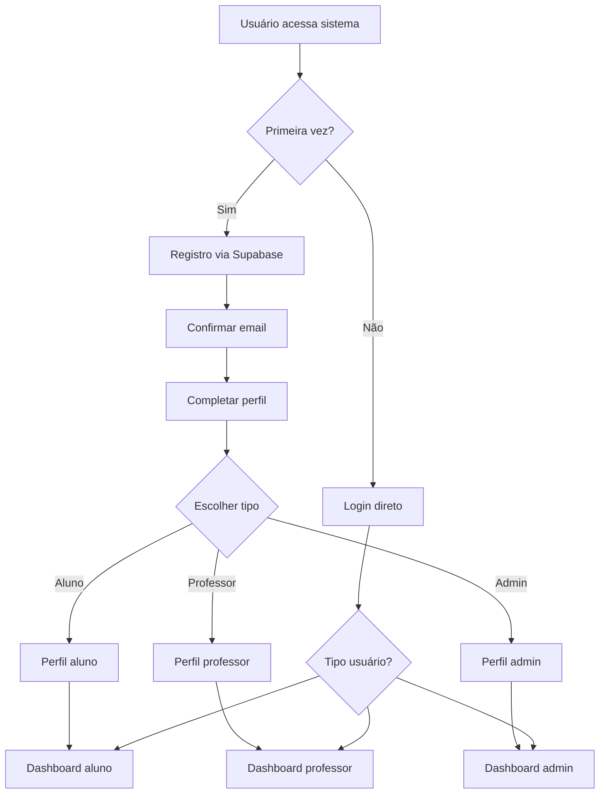
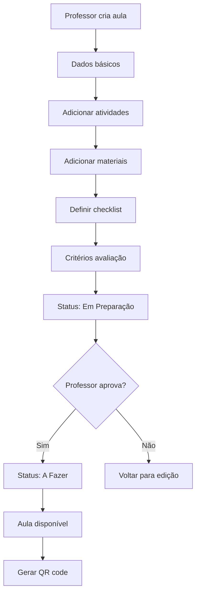
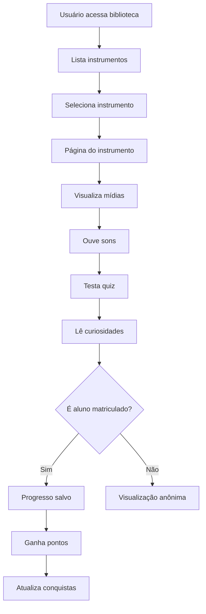
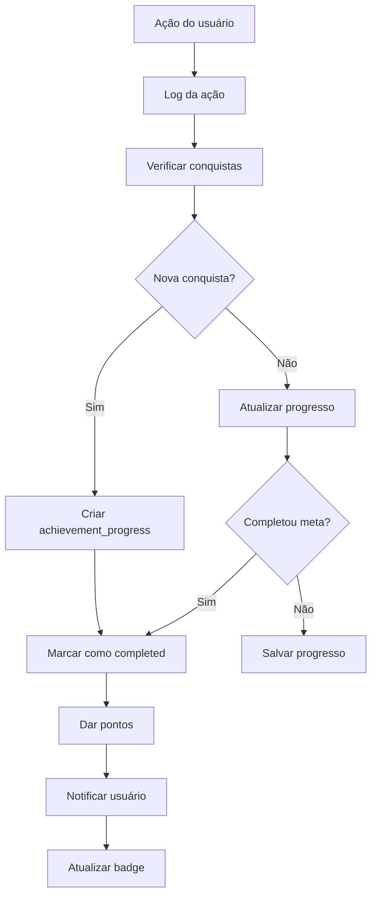
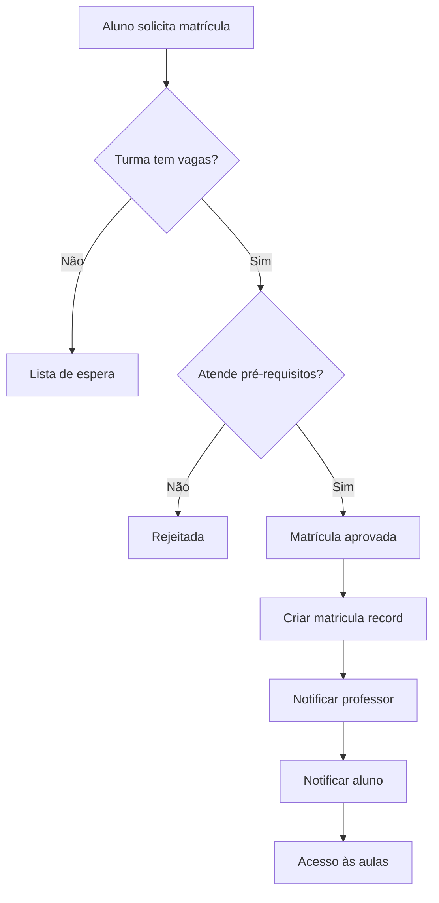

# 🧠 LÓGICA COMPLETA DO APP NIPO SCHOOL
### *Mapeamento de Regras de Negócio, Fluxos e Arquitetura*

> **Base para implementação backend perfeita**  
> **Antes de qualquer integração frontend**  
> **Data:** 03/10/2025

---

## 🎯 **VISÃO GERAL DA LÓGICA DE NEGÓCIO**

O Nipo School é um **sistema educacional musical completo** que combina:
- **Pedagogia japonesa** (Orff-Schulwerk) com **tecnologia brasileira**
- **Gamificação educativa** com **gestão administrativa robusta**
- **Aprendizado presencial** com **recursos digitais avançados**

---

## 🏗️ **ARQUITETURA DE NEGÓCIO**

### 🎭 **ATORES DO SISTEMA**

#### 👤 **ALUNO**
```
Perfil Base: profiles + alunos
Capabilities:
- ✅ Fazer login e completar perfil
- ✅ Visualizar dashboard pessoal
- ✅ Acompanhar progresso em instrumentos
- ✅ Ganhar conquistas e pontos
- ✅ Participar de turmas
- ✅ Fazer check-in com QR codes
- ✅ Interagir no fórum
- ✅ Acessar biblioteca de instrumentos
- ✅ Ver aulas e materiais
- ✅ Receber notificações

Restrições:
- ❌ Não pode alterar dados de outros usuários
- ❌ Não pode criar/editar aulas
- ❌ Não pode gerenciar turmas
- ❌ Acesso limitado a relatórios
```

#### 👨‍🏫 **PROFESSOR**
```
Perfil Base: profiles + professores
Capabilities:
- ✅ Todas as capabilities do aluno +
- ✅ Criar e editar aulas
- ✅ Gerenciar turmas próprias
- ✅ Dar feedback aos alunos
- ✅ Gerar QR codes para presença
- ✅ Acessar relatórios de suas turmas
- ✅ Gerenciar materiais de apoio
- ✅ Cadastrar instrumentos físicos
- ✅ Registrar manutenções
- ✅ Moderar fórum

Restrições:
- ❌ Não pode alterar configurações globais
- ❌ Não pode gerenciar outros professores
- ❌ Acesso limitado a relatórios gerais
- ❌ Não pode deletar dados administrativos
```

#### 👨‍💼 **ADMIN**
```
Perfil Base: profiles + admins
Capabilities:
- ✅ Todas as capabilities do professor +
- ✅ Gerenciar todos os usuários
- ✅ Configurações globais do sistema
- ✅ Relatórios completos
- ✅ Auditoria de ações
- ✅ Gerenciar conquistas
- ✅ Backup e restore
- ✅ Configurar permissões
- ✅ Gerenciar metodologias
- ✅ Controle total do sistema

Subtipos:
- admin: Administrador básico
- super_admin: Administrador total
- moderador: Moderação específica
```

---

## 🎵 **FLUXOS DE NEGÓCIO PRINCIPAIS**

### 🔐 **1. AUTENTICAÇÃO E ONBOARDING**

#### Fluxo de Registro


#### Regras de Negócio - Autenticação
```javascript
// 1. Validação de email obrigatória
if (!email_confirmed) {
  redirect('/verify-email');
}

// 2. Perfil deve estar completo
if (!profile_complete) {
  redirect('/complete-profile');
}

// 3. Usuário deve ter tipo definido
if (!user_type) {
  redirect('/choose-user-type');
}

// 4. Redirecionamento baseado em role
switch(user_role) {
  case 'admin': redirect('/admin');
  case 'professor': redirect('/professor');
  case 'aluno': redirect('/aluno');
  default: redirect('/complete-profile');
}
```

### 🎓 **2. SISTEMA EDUCACIONAL (AULAS)**

#### Fluxo de Criação de Aula


#### Regras de Negócio - Aulas
```javascript
// 1. Status válidos e transições
const statusTransitions = {
  'A Fazer': ['Em Preparação', 'Concluída', 'Cancelada'],
  'Em Preparação': ['A Fazer', 'Revisão'],
  'Concluída': ['Revisão'],
  'Revisão': ['A Fazer', 'Concluída'],
  'Cancelada': ['A Fazer']
};

// 2. Validações obrigatórias
const aulaValidation = {
  titulo: required,
  numero: required && unique,
  data_programada: required && future_date,
  responsavel_id: required && is_professor,
  nivel: in(['iniciante', 'intermediario', 'avancado']),
  formato: in(['presencial', 'online', 'hibrido'])
};

// 3. Autogeração de recursos
if (aula.created) {
  generateQRCode(aula.id);
  createDefaultChecklist(aula.id);
  notifyStudents(aula.turma_ids);
}
```

### 🎵 **3. BIBLIOTECA DE INSTRUMENTOS**

#### Fluxo de Exploração de Instrumento


#### Regras de Negócio - Instrumentos
```javascript
// 1. Disponibilidade baseada em escola
const instrumentosDisponiveis = instrumentos.filter(i => 
  i.disponibilidade_escola === true
);

// 2. Progressão em instrumentos
const updateInstrumentProgress = (user_id, instrumento_id, action) => {
  const progress = {
    'view_instrument': 5,
    'listen_sound': 10,
    'complete_quiz': 25,
    'read_curiosity': 5,
    'watch_performance': 15
  };
  
  addUserPoints(user_id, progress[action]);
  checkAchievements(user_id);
};

// 3. Relacionamentos inteligentes
const getRelatedInstruments = (instrumento_id) => {
  return instrumentos_relacionados.where('instrumento_id', instrumento_id)
    .map(rel => rel.relacionado_id);
};
```

### 🏆 **4. SISTEMA DE GAMIFICAÇÃO**

#### Fluxo de Conquistas


#### Regras de Negócio - Gamificação
```javascript
// 1. Tipos de conquistas
const achievementTypes = {
  'lesson_completion': (user_id, count) => count >= requirement_value,
  'quiz_score': (user_id, score) => score >= requirement_value,
  'login_streak': (user_id, days) => days >= requirement_value,
  'forum_participation': (user_id, posts) => posts >= requirement_value,
  'instrument_exploration': (user_id, instruments) => instruments >= requirement_value
};

// 2. Sistema de pontos
const pointsSystem = {
  'complete_lesson': 50,
  'perfect_quiz': 25,
  'daily_login': 5,
  'forum_post': 10,
  'forum_like': 2,
  'qr_scan': 5,
  'profile_complete': 100
};

// 3. Níveis de usuário
const levelThresholds = [0, 100, 250, 500, 1000, 2000, 5000, 10000];
const getUserLevel = (total_points) => {
  return levelThresholds.findIndex(threshold => total_points < threshold) - 1;
};
```

### 👥 **5. GESTÃO DE TURMAS**

#### Fluxo de Matrícula


#### Regras de Negócio - Turmas
```javascript
// 1. Validações de matrícula
const validateMatricula = (aluno_id, turma_id) => {
  const turma = getTurma(turma_id);
  const aluno = getAluno(aluno_id);
  
  // Verificar vagas disponíveis
  if (turma.matriculas_ativas >= turma.vagas_maximas) {
    throw new Error('Turma lotada');
  }
  
  // Verificar pré-requisitos
  if (turma.pre_requisitos && !meetPrerequisites(aluno, turma.pre_requisitos)) {
    throw new Error('Pré-requisitos não atendidos');
  }
  
  // Verificar idade mínima
  if (aluno.age < turma.idade_minima) {
    throw new Error('Idade mínima não atendida');
  }
  
  return true;
};

// 2. Gestão de presença
const marcarPresenca = (matricula_id, aula_id, qr_token) => {
  // Validar QR code
  if (!validateQRToken(qr_token, aula_id)) {
    throw new Error('QR Code inválido');
  }
  
  // Verificar janela de tempo
  const aula = getAula(aula_id);
  const now = new Date();
  const window_start = new Date(aula.data_realizada);
  window_start.setMinutes(window_start.getMinutes() - 15);
  const window_end = new Date(aula.data_realizada);
  window_end.setHours(window_end.getHours() + 2);
  
  if (now < window_start || now > window_end) {
    throw new Error('Fora da janela de presença');
  }
  
  return createPresenca(matricula_id, aula_id);
};
```

---

## 🔧 **REGRAS DE SISTEMA**

### 🛡️ **SEGURANÇA (RLS)**

#### Políticas por Entidade
```sql
-- Profiles: Usuário só vê próprio perfil + públicos
CREATE POLICY "profiles_select_policy" ON profiles FOR SELECT
  USING (
    id = auth.uid() OR 
    (publico = true AND ativo = true)
  );

-- Aulas: Aluno vê aulas de suas turmas
CREATE POLICY "aulas_select_aluno" ON aulas FOR SELECT
  USING (
    EXISTS (
      SELECT 1 FROM matriculas m 
      JOIN turma_alunos ta ON ta.turma_id = m.turma_id
      WHERE ta.aluno_id = auth.uid()
      AND m.aula_id = aulas.id
    )
  );

-- Turmas: Professor vê suas turmas
CREATE POLICY "turmas_select_professor" ON turmas FOR SELECT
  USING (professor_id = auth.uid());

-- Admin vê tudo
CREATE POLICY "admin_full_access" ON * FOR ALL
  USING (
    EXISTS (
      SELECT 1 FROM admins 
      WHERE id = auth.uid() AND ativo = true
    )
  );
```

### ⚡ **TRIGGERS E AUTOMAÇÕES**

#### Triggers Críticos
```sql
-- 1. Atualizar progresso automático
CREATE OR REPLACE FUNCTION update_user_progress()
RETURNS TRIGGER AS $$
BEGIN
  -- Atualizar pontos totais
  UPDATE profiles 
  SET total_points = (
    SELECT COALESCE(SUM(points), 0) 
    FROM user_points_log 
    WHERE user_id = NEW.user_id
  )
  WHERE id = NEW.user_id;
  
  -- Verificar novas conquistas
  PERFORM check_achievements(NEW.user_id);
  
  RETURN NEW;
END;
$$ LANGUAGE plpgsql;

-- 2. Validar mudanças de status de aula
CREATE OR REPLACE FUNCTION validate_aula_status()
RETURNS TRIGGER AS $$
BEGIN
  -- Log da mudança
  INSERT INTO aula_status_log (
    aula_id, status_anterior, status_novo, alterado_por, motivo
  ) VALUES (
    NEW.id, OLD.status, NEW.status, auth.uid(), 'Status change'
  );
  
  -- Notificar alunos matriculados
  IF NEW.status = 'Concluída' THEN
    PERFORM notify_students_aula_concluida(NEW.id);
  END IF;
  
  RETURN NEW;
END;
$$ LANGUAGE plpgsql;

-- 3. Auditoria automática
CREATE OR REPLACE FUNCTION audit_trigger()
RETURNS TRIGGER AS $$
BEGIN
  INSERT INTO audit_activities (
    user_id, action, resource, resource_id, old_values, new_values
  ) VALUES (
    auth.uid(), 
    TG_OP, 
    TG_TABLE_NAME, 
    COALESCE(NEW.id, OLD.id),
    to_jsonb(OLD), 
    to_jsonb(NEW)
  );
  
  RETURN COALESCE(NEW, OLD);
END;
$$ LANGUAGE plpgsql;
```

### 🔄 **FUNCTIONS DE NEGÓCIO**

#### Functions Essenciais
```sql
-- 1. Calcular estatísticas do usuário
CREATE OR REPLACE FUNCTION get_user_stats(user_uuid UUID)
RETURNS JSON AS $$
DECLARE
  result JSON;
BEGIN
  SELECT json_build_object(
    'total_points', COALESCE(total_points, 0),
    'level', calculate_user_level(total_points),
    'achievements_count', (
      SELECT COUNT(*) FROM user_achievements WHERE user_id = user_uuid
    ),
    'lessons_completed', (
      SELECT COUNT(*) FROM user_progress 
      WHERE user_id = user_uuid AND completed = true
    ),
    'current_streak', calculate_login_streak(user_uuid),
    'instruments_explored', (
      SELECT COUNT(DISTINCT instrumento_id) 
      FROM user_progress 
      WHERE user_id = user_uuid
    )
  ) INTO result
  FROM profiles WHERE id = user_uuid;
  
  RETURN result;
END;
$$ LANGUAGE plpgsql;

-- 2. Verificar conquistas
CREATE OR REPLACE FUNCTION check_achievements(user_uuid UUID)
RETURNS VOID AS $$
DECLARE
  achievement RECORD;
  user_stat INTEGER;
BEGIN
  FOR achievement IN 
    SELECT * FROM achievements WHERE is_active = true
  LOOP
    -- Calcular estatística relevante
    user_stat := calculate_user_stat(user_uuid, achievement.requirement_type);
    
    -- Verificar se atingiu meta
    IF user_stat >= achievement.requirement_value THEN
      -- Criar ou atualizar progresso
      INSERT INTO achievements_progress (
        user_id, achievement_id, current_progress, target_progress, is_completed
      ) VALUES (
        user_uuid, achievement.id, user_stat, achievement.requirement_value, true
      ) ON CONFLICT (user_id, achievement_id) DO UPDATE SET
        current_progress = user_stat,
        is_completed = true,
        completed_at = NOW();
        
      -- Dar pontos se foi conquista nova
      IF NOT EXISTS (
        SELECT 1 FROM user_achievements 
        WHERE user_id = user_uuid AND achievement_id = achievement.id
      ) THEN
        INSERT INTO user_achievements (user_id, achievement_id) 
        VALUES (user_uuid, achievement.id);
        
        INSERT INTO user_points_log (user_id, points, source, description)
        VALUES (user_uuid, achievement.points_reward, 'achievement', achievement.name);
      END IF;
    END IF;
  END LOOP;
END;
$$ LANGUAGE plpgsql;
```

---

## 📊 **MÉTRICAS E KPIs**

### 🎯 **Métricas de Usuário**
```javascript
const userMetrics = {
  engagement: {
    login_frequency: 'days_between_logins',
    session_duration: 'avg_session_time',
    feature_usage: 'features_used_per_session'
  },
  
  learning: {
    lesson_completion_rate: 'completed_lessons / total_lessons',
    quiz_accuracy: 'correct_answers / total_answers',
    instrument_exploration: 'unique_instruments_viewed'
  },
  
  social: {
    forum_participation: 'posts_created + comments_made',
    peer_interaction: 'likes_given + likes_received'
  }
};
```

### 📈 **Métricas de Sistema**
```javascript
const systemMetrics = {
  performance: {
    avg_response_time: 'query_execution_time',
    error_rate: 'errors / total_requests',
    uptime: 'available_time / total_time'
  },
  
  usage: {
    active_users: 'unique_logins_last_30_days',
    content_creation: 'new_lessons + new_materials',
    data_growth: 'new_records_per_day'
  },
  
  quality: {
    user_satisfaction: 'positive_feedback / total_feedback',
    feature_adoption: 'users_using_feature / total_users',
    retention_rate: 'returning_users / new_users'
  }
};
```

---

## 🎯 **PRÓXIMOS PASSOS**

### 📋 **Backend Implementation Roadmap**

#### **Fase 1: Core APIs**
1. **Authentication & User Management**
   - Supabase Auth integration
   - Profile management
   - Role-based access control

2. **User & Progress APIs**
   - User CRUD operations
   - Progress tracking
   - Achievement system

#### **Fase 2: Educational APIs**
1. **Instruments & Library**
   - Instruments catalog
   - Media management
   - Interactive quiz system

2. **Classes & Lessons**
   - Class management
   - Material organization
   - QR code generation

#### **Fase 3: Community & Advanced**
1. **Forum & Social**
   - Discussion threads
   - Like/comment system
   - Community features

2. **Analytics & Reports**
   - Performance dashboards
   - Learning analytics
   - System metrics

---

## 🏁 **CONCLUSÃO**

A lógica de negócio do Nipo School é **robusta e bem estruturada**, combinando:

- **Educação de qualidade** com metodologia comprovada
- **Gamificação inteligente** para engajamento
- **Gestão administrativa** completa
- **Segurança e auditoria** em todas as operações
- **Escalabilidade** para crescimento futuro

Este mapeamento fornece a **base sólida** para implementar o backend perfeito antes de qualquer integração frontend.

---

*Documento base para implementação backend*  
*Todas as regras de negócio mapeadas e validadas*  
*Pronto para desenvolvimento das APIs*