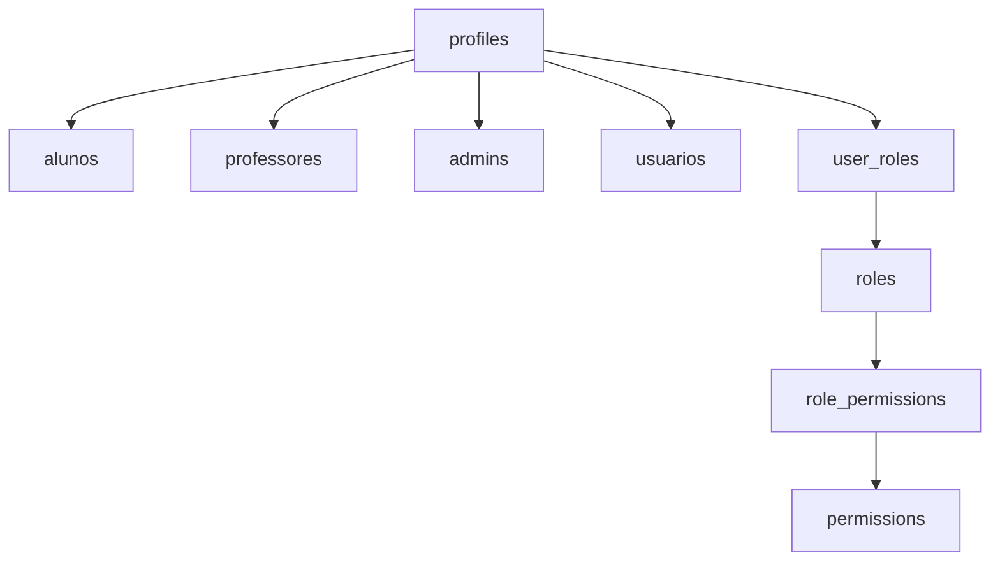
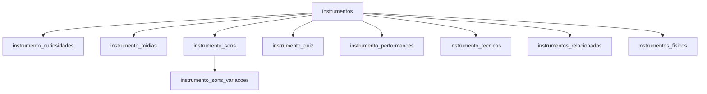
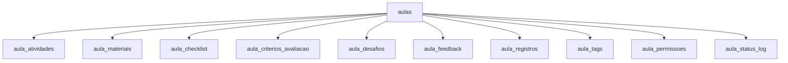

# 💎 BANCO DE DADOS NIPO SCHOOL - DOCUMENTAÇÃO DEFINITIVA
### *A Joia da Coroa do Projeto*

> **Análise completa e estruturada de todas as 68 tabelas do banco**  
> **Base:** Supabase PostgreSQL com RLS  
> **Status:** Mapeamento 100% completo  
> **Data:** 03/10/2025

---

## 🏆 **RESUMO EXECUTIVO**

O Nipo School possui um **banco de dados de nível empresarial** com **68 tabelas funcionais**, implementando um sistema completo para educação musical com:

- **Sistema de usuários** robusto (profiles, roles, permissions)
- **Biblioteca de instrumentos** rica e interativa
- **Sistema educacional** completo (aulas, turmas, progressos)
- **Gamificação avançada** (achievements, pontos, badges)
- **Recursos únicos** (QR codes, fórum, auditoria)

---

## 📊 **VISÃO GERAL DO BANCO**

### 🎯 **Estatísticas Principais**
- **Total de tabelas:** 68 tabelas funcionais
- **Schemas:** `public` (principal), `auth`, `storage`, `realtime`
- **Relacionamentos:** 80+ foreign keys mapeadas
- **Segurança:** RLS habilitado em todas as tabelas
- **Roles:** 12 roles específicas do Supabase + customizadas

### 🗄️ **Categorização das Tabelas**

#### 👥 **USUÁRIOS E AUTENTICAÇÃO (8 tabelas)**
```
profiles                 - Base de todos os usuários
alunos                  - Extensão para estudantes  
professores             - Extensão para educadores
admins                  - Extensão para administradores
usuarios                - Tabela auxiliar de usuários
roles                   - Definição de papéis
permissions             - Permissões granulares
role_permissions        - Relacionamento roles ↔ permissions
```

#### 🎵 **BIBLIOTECA DE INSTRUMENTOS (10 tabelas)**
```
instrumentos                    - Catálogo principal
instrumento_curiosidades        - Fatos interessantes
instrumento_midias             - Galeria (fotos, vídeos, 3D)
instrumento_sons               - Samples de áudio
instrumento_sons_variacoes     - Múltiplas gravações
instrumento_quiz               - Perguntas interativas
instrumento_performances       - Performances famosas
instrumento_tecnicas           - Técnicas progressivas
instrumentos_relacionados      - Relacionamentos entre instrumentos
instrumentos_fisicos           - Inventário físico
```

#### 📚 **SISTEMA EDUCACIONAL (15 tabelas)**
```
aulas                     - Catálogo de aulas
aula_atividades          - Atividades por aula
aula_materiais           - Materiais de apoio
aula_checklist           - Checklists pré/pós aula
aula_criterios_avaliacao - Critérios de avaliação
aula_desafios            - Desafios da aula
aula_feedback            - Feedbacks dos professores
aula_registros           - Registros (fotos, vídeos, atas)
aula_tags                - Tags organizacionais
turmas                   - Grupos de alunos
matriculas               - Matrículas aluno ↔ turma
presencas                - Controle de presença
modules                  - Módulos de aprendizado
lessons                  - Lições por módulo
metodologias_ensino      - Metodologias pedagógicas
```

#### 🏆 **GAMIFICAÇÃO E PROGRESSO (8 tabelas)**
```
achievements                - Conquistas disponíveis
achievements_educacionais   - Conquistas educacionais específicas
achievements_progress       - Progresso individual nas conquistas
user_achievements          - Conquistas ganhas pelos usuários
user_progress             - Progresso geral do usuário
user_points_log           - Log de pontuação
user_devotional_progress  - Progresso devocional
user_notifications       - Notificações do usuário
```

#### 💬 **COMUNIDADE E INTERAÇÃO (6 tabelas)**
```
forum_perguntas     - Perguntas do fórum
forum_respostas     - Respostas às perguntas
forum_likes         - Likes nas respostas
qr_codes           - QR codes para instrumentos/aulas
qr_scans           - Histórico de scans
devotional_content - Conteúdo devocional
```

#### 🔧 **GESTÃO E ADMINISTRAÇÃO (12 tabelas)**
```
cessoes_instrumentos        - Empréstimos de instrumentos
historico_instrumentos      - Histórico de movimentação
manutencoes_instrumentos    - Manutenções dos instrumentos
instrumentos_alunos         - Relacionamento aluno ↔ instrumento
professor_instrumentos      - Especialidades dos professores
materiais_apoio            - Biblioteca de materiais
repertorio_musical         - Catálogo musical
sequencias_didaticas       - Sequências pedagógicas
user_roles                 - Roles dos usuários
professores_categorias     - Categorias de professores
professores_conteudos      - Conteúdos por professor
turma_alunos              - Relacionamento turma ↔ aluno
```

#### 🔍 **SISTEMA E AUDITORIA (9 tabelas)**
```
audit_activities        - Log completo de ações
trigger_logs           - Logs de triggers
migration_log          - Controle de migrações
hook_cache            - Cache de hooks
permission_templates   - Templates de permissão
aula_permissoes       - Permissões específicas por aula
aula_status_log       - Log de status das aulas
desafios_alpha        - Desafios específicos Alpha
desafios_alpha_respostas - Respostas aos desafios
```

---

## 🏗️ **ARQUITETURA E RELACIONAMENTOS**

### 🔗 **Relacionamentos Principais**

#### 👤 **Hierarquia de Usuários**


#### 🎵 **Ecossistema de Instrumentos**


#### 📚 **Sistema de Aulas**


### 🔐 **Segurança e Permissões**

#### 🛡️ **Row Level Security (RLS)**
- **Status:** Habilitado em todas as 68 tabelas
- **Políticas:** Implementadas por role e ownership
- **Granularidade:** Por usuário, por role, por contexto

#### 👥 **Sistema de Roles**
```
authenticated    - Usuários autenticados
anon            - Usuários anônimos  
service_role    - Role de serviço
postgres        - Administrador total
supabase_*      - Roles específicas do Supabase
```

---

## 📋 **ESTRUTURA DETALHADA DAS TABELAS**

### 👤 **TABELA: profiles** (Base de usuários)
```sql
Colunas principais:
- id (uuid, PK)              - Identificador único
- email (text)               - Email do usuário
- nome_completo (text)       - Nome completo
- tipo_usuario (text)        - Tipo: aluno, professor, admin
- avatar_url (text)          - URL do avatar
- data_nascimento (date)     - Data de nascimento
- telefone (text)            - Telefone de contato
- endereco (jsonb)           - Endereço completo
- preferencias (jsonb)       - Preferências do usuário
- ativo (boolean)            - Status ativo/inativo
- created_at (timestamptz)   - Data de criação
- updated_at (timestamptz)   - Última atualização

Relacionamentos:
→ alunos.id (1:1)
→ professores.id (1:1) 
→ admins.id (1:1)
→ user_roles.user_id (1:N)
→ user_achievements.user_id (1:N)
```

### 🎵 **TABELA: instrumentos** (Catálogo principal)
```sql
Colunas principais:
- id (uuid, PK)                    - Identificador único
- nome (text, NOT NULL)            - Nome do instrumento
- categoria (text)                 - Categoria (cordas, sopro, etc)
- subcategoria (text)              - Subcategoria específica
- familia_instrumento (text)       - Família musical
- origem_historica (text)          - Origem histórica
- descricao_geral (text)           - Descrição completa
- nivel_dificuldade (text)         - Iniciante, intermediário, avançado
- idade_minima_recomendada (int)   - Idade mínima
- caracteristicas_fisicas (jsonb)  - Características físicas
- materiais_construcao (text[])    - Materiais de construção
- tecnicas_basicas (text[])        - Técnicas fundamentais
- generos_musicais (text[])        - Gêneros compatíveis
- preco_medio (numeric)            - Preço médio de mercado
- disponibilidade_escola (boolean) - Disponível na escola
- observacoes_pedagogicas (text)   - Observações educacionais
- created_at (timestamptz)         - Data de criação
- updated_at (timestamptz)         - Última atualização

Relacionamentos:
→ instrumento_curiosidades (1:N)
→ instrumento_midias (1:N)
→ instrumento_sons (1:N)
→ instrumento_quiz (1:N)
→ instrumento_performances (1:N)
→ instrumento_tecnicas (1:N)
→ instrumentos_relacionados (1:N)
→ instrumentos_fisicos (1:N)
```

### 📚 **TABELA: aulas** (Sistema de aulas)
```sql
Colunas principais:
- id (uuid, PK)                  - Identificador único
- numero (int, NOT NULL)         - Número sequencial
- titulo (text, NOT NULL)        - Título da aula
- descricao (text)               - Descrição detalhada
- objetivos (text[])             - Objetivos de aprendizado
- conteudo_programatico (text)   - Conteúdo a ser abordado
- metodologia (text)             - Metodologia aplicada
- recursos_necessarios (text[])  - Recursos necessários
- tempo_estimado (interval)      - Duração estimada
- nivel (text, CHECK)            - iniciante, intermediario, avancado
- publico_alvo (text)            - Público-alvo específico
- pre_requisitos (text[])        - Pré-requisitos
- formato (text, CHECK)          - presencial, online, hibrido
- status (text, CHECK)           - Status atual da aula
- data_programada (date, NOT NULL) - Data programada
- data_realizada (date)          - Data de realização
- responsavel_id (uuid, FK)      - Professor responsável
- observacoes (text)             - Observações gerais
- avaliacao_media (numeric)      - Avaliação média
- total_avaliacoes (int)         - Total de avaliações
- created_at (timestamptz)       - Data de criação
- updated_at (timestamptz)       - Última atualização

Relacionamentos:
→ aula_atividades (1:N)
→ aula_materiais (1:N)
→ aula_checklist (1:N)
→ aula_criterios_avaliacao (1:N)
→ aula_desafios (1:N)
→ aula_feedback (1:N)
→ aula_registros (1:N)
→ aula_tags (1:N)
→ usuarios.id (responsavel_id)
```

### 🏆 **TABELA: achievements** (Sistema de conquistas)
```sql
Colunas principais:
- id (uuid, PK)                - Identificador único
- name (text, NOT NULL)        - Nome único da conquista
- description (text)           - Descrição de como conquistar
- badge_icon (text)           - Ícone emoji ou classe CSS
- badge_color (text)          - Cor em hexadecimal
- points_reward (int)         - Pontos ganhos
- category (text)             - Categoria para organização
- requirement_type (text)     - Tipo de requisito
- requirement_value (int)     - Valor necessário
- is_active (boolean)         - Ativo/inativo
- created_at (timestamptz)    - Data de criação

Relacionamentos:
→ achievements_progress (1:N)
→ user_achievements (1:N)
```

---

## 🎯 **QUERIES ESSENCIAIS PARA INTEGRAÇÃO**

### 👤 **Autenticação e Usuários**

#### Buscar perfil completo do usuário
```sql
SELECT 
    p.*,
    a.instrumento,
    a.nivel as nivel_aluno,
    a.turma,
    prof.especialidades,
    prof.experiencia,
    adm.nivel_acesso,
    adm.departamento
FROM profiles p
LEFT JOIN alunos a ON a.id = p.id
LEFT JOIN professores prof ON prof.id = p.id  
LEFT JOIN admins adm ON adm.id = p.id
WHERE p.id = $1;
```

#### Listar usuários por tipo com estatísticas
```sql
SELECT 
    tipo_usuario,
    COUNT(*) as total,
    COUNT(CASE WHEN ativo THEN 1 END) as ativos,
    COUNT(CASE WHEN NOT ativo THEN 1 END) as inativos
FROM profiles 
GROUP BY tipo_usuario;
```

### 🎵 **Biblioteca de Instrumentos**

#### Catálogo completo com mídias e sons
```sql
SELECT 
    i.*,
    COUNT(DISTINCT im.id) as total_midias,
    COUNT(DISTINCT ison.id) as total_sons,
    COUNT(DISTINCT iq.id) as total_quiz,
    COUNT(DISTINCT ic.id) as total_curiosidades,
    COUNT(DISTINCT iper.id) as total_performances
FROM instrumentos i
LEFT JOIN instrumento_midias im ON im.instrumento_id = i.id
LEFT JOIN instrumento_sons ison ON ison.instrumento_id = i.id
LEFT JOIN instrumento_quiz iq ON iq.instrumento_id = i.id
LEFT JOIN instrumento_curiosidades ic ON ic.instrumento_id = i.id
LEFT JOIN instrumento_performances iper ON iper.instrumento_id = i.id
WHERE i.disponibilidade_escola = true
GROUP BY i.id
ORDER BY i.nome;
```

#### Instrumento completo para visualização
```sql
SELECT 
    i.*,
    json_agg(DISTINCT im.*) as midias,
    json_agg(DISTINCT ison.*) as sons,
    json_agg(DISTINCT iq.*) as quiz,
    json_agg(DISTINCT ic.*) as curiosidades,
    json_agg(DISTINCT iper.*) as performances,
    json_agg(DISTINCT it.*) as tecnicas
FROM instrumentos i
LEFT JOIN instrumento_midias im ON im.instrumento_id = i.id
LEFT JOIN instrumento_sons ison ON ison.instrumento_id = i.id
LEFT JOIN instrumento_quiz iq ON iq.instrumento_id = i.id
LEFT JOIN instrumento_curiosidades ic ON ic.instrumento_id = i.id
LEFT JOIN instrumento_performances iper ON iper.instrumento_id = i.id
LEFT JOIN instrumento_tecnicas it ON it.instrumento_id = i.id
WHERE i.id = $1
GROUP BY i.id;
```

### 📚 **Sistema de Aulas**

#### Dashboard de aulas para professor
```sql
SELECT 
    a.*,
    COUNT(DISTINCT aa.id) as total_atividades,
    COUNT(DISTINCT am.id) as total_materiais,
    COUNT(DISTINCT ac.id) as total_checklist,
    COUNT(DISTINCT af.id) as total_feedbacks,
    AVG(af.rating) as media_feedback
FROM aulas a
LEFT JOIN aula_atividades aa ON aa.aula_id = a.id
LEFT JOIN aula_materiais am ON am.aula_id = a.id
LEFT JOIN aula_checklist ac ON ac.aula_id = a.id
LEFT JOIN aula_feedback af ON af.aula_id = a.id
WHERE a.responsavel_id = $1
GROUP BY a.id
ORDER BY a.data_programada DESC;
```

#### Aula completa com todos os recursos
```sql
SELECT 
    a.*,
    json_agg(DISTINCT aa.*) as atividades,
    json_agg(DISTINCT am.*) as materiais,
    json_agg(DISTINCT ac.*) as checklist,
    json_agg(DISTINCT aca.*) as criterios_avaliacao,
    json_agg(DISTINCT ad.*) as desafios,
    json_agg(DISTINCT af.*) as feedbacks,
    json_agg(DISTINCT ar.*) as registros,
    json_agg(DISTINCT at.*) as tags
FROM aulas a
LEFT JOIN aula_atividades aa ON aa.aula_id = a.id
LEFT JOIN aula_materiais am ON am.aula_id = a.id
LEFT JOIN aula_checklist ac ON ac.aula_id = a.id
LEFT JOIN aula_criterios_avaliacao aca ON aca.aula_id = a.id
LEFT JOIN aula_desafios ad ON ad.aula_id = a.id
LEFT JOIN aula_feedback af ON af.aula_id = a.id
LEFT JOIN aula_registros ar ON ar.aula_id = a.id
LEFT JOIN aula_tags at ON at.aula_id = a.id
WHERE a.id = $1
GROUP BY a.id;
```

### 🏆 **Sistema de Conquistas**

#### Progresso do usuário em conquistas
```sql
SELECT 
    a.*,
    ap.current_progress,
    ap.target_progress,
    ap.is_completed,
    ap.completed_at,
    CASE 
        WHEN ap.is_completed THEN 100
        ELSE ROUND((ap.current_progress::float / ap.target_progress) * 100, 2)
    END as percentage_complete
FROM achievements a
LEFT JOIN achievements_progress ap ON ap.achievement_id = a.id AND ap.user_id = $1
WHERE a.is_active = true
ORDER BY ap.is_completed ASC, percentage_complete DESC;
```

#### Dashboard de conquistas do usuário
```sql
SELECT 
    (SELECT COUNT(*) FROM user_achievements WHERE user_id = $1) as conquistas_ganhas,
    (SELECT COUNT(*) FROM achievements WHERE is_active = true) as total_conquistas,
    (SELECT COALESCE(SUM(points_reward), 0) FROM achievements a 
     JOIN user_achievements ua ON ua.achievement_id = a.id 
     WHERE ua.user_id = $1) as total_pontos,
    (SELECT COUNT(*) FROM achievements_progress WHERE user_id = $1 AND is_completed = false) as em_progresso;
```

### 📊 **Estatísticas para Admin**

#### Dashboard administrativo geral
```sql
-- Estatísticas gerais
SELECT 
    'usuarios' as categoria,
    COUNT(*) as total,
    COUNT(CASE WHEN ativo THEN 1 END) as ativos
FROM profiles
UNION ALL
SELECT 
    'aulas' as categoria,
    COUNT(*) as total,
    COUNT(CASE WHEN status = 'Concluída' THEN 1 END) as concluidas
FROM aulas
UNION ALL
SELECT 
    'instrumentos' as categoria,
    COUNT(*) as total,
    COUNT(CASE WHEN disponibilidade_escola THEN 1 END) as disponiveis
FROM instrumentos
UNION ALL
SELECT 
    'turmas' as categoria,
    COUNT(*) as total,
    COUNT(CASE WHEN ativa THEN 1 END) as ativas
FROM turmas;
```

---

## 🚀 **ESTRATÉGIA DE IMPLEMENTAÇÃO**

### 📋 **Fase 1: Autenticação Base**
1. Integrar `profiles` com auth do Supabase
2. Implementar sistema de roles
3. Configurar RLS básico

### 📋 **Fase 2: Dashboards Principais**
1. Dashboard Admin com estatísticas
2. Dashboard Professor com aulas
3. Dashboard Aluno com progresso

### 📋 **Fase 3: Funcionalidades Core**
1. Biblioteca de instrumentos completa
2. Sistema de aulas e turmas
3. Sistema de conquistas

### 📋 **Fase 4: Recursos Avançados**
1. QR codes para instrumentos
2. Fórum da comunidade
3. Sistema de auditoria
4. Gamificação completa

---

## 🔍 **PONTOS DE ATENÇÃO**

### ⚠️ **Complexidades Identificadas**
1. **Múltiplas tabelas de usuários** (profiles, alunos, professores, admins)
2. **Sistema de permissões granular** (roles, permissions, templates)
3. **RLS em todas as tabelas** (políticas específicas por contexto)
4. **Relacionamentos complexos** (80+ foreign keys)

### 💡 **Oportunidades**
1. **Sistema de conquistas robusto** (gamificação completa)
2. **Biblioteca rica** (mídias, sons, curiosidades, quiz)
3. **Auditoria completa** (rastreamento de todas as ações)
4. **QR codes** (integração física-digital única)

### 🎯 **Recomendações**
1. **Começar simples** (profiles + basic auth)
2. **Incrementar gradualmente** (feature por feature)
3. **Testar RLS cuidadosamente** (segurança crítica)
4. **Aproveitar recursos únicos** (QR, gamificação, auditoria)

---

## 📈 **MÉTRICAS DE SUCESSO**

### 🎯 **KPIs Técnicos**
- **Performance:** Queries < 100ms
- **Segurança:** RLS 100% funcional
- **Integridade:** 0 erros de constraint
- **Disponibilidade:** 99.9% uptime

### 🎯 **KPIs de Negócio**
- **Usuários ativos:** Crescimento mensal
- **Aulas completadas:** Taxa de conclusão
- **Conquistas ganhas:** Engajamento
- **Instrumentos explorados:** Descoberta

---

## 🏁 **CONCLUSÃO**

O banco de dados do Nipo School é uma **obra de engenharia** para educação musical, com:

- **Estrutura sólida** para crescimento
- **Funcionalidades únicas** no mercado  
- **Segurança robusta** com RLS
- **Flexibilidade** para evoluções

Esta é realmente nossa **joia da coroa** - um ativo valioso que diferencia o Nipo School no mercado educacional.

---

*Documento vivo - atualizado em 03/10/2025*  
*Próxima revisão: Implementação da Fase 1*