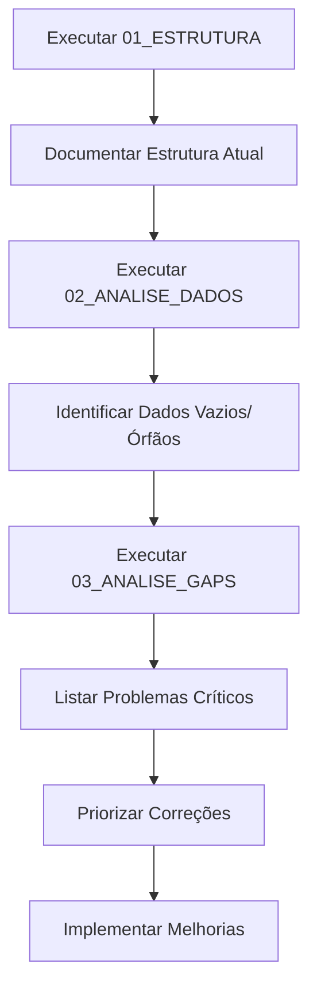

# 🔍 Investigação Profunda do Banco de Dados - Nipo School

**Data:** 15/12/2025  
**Objetivo:** Mapear, analisar e melhorar a estrutura completa do banco de dados

---

## 📂 Estrutura desta Pasta

```
resposta_banco/
├── README.md                          # Este arquivo (índice)
├── 01_ESTRUTURA_COMPLETA.sql         # Mapeamento de schemas, tabelas, colunas, constraints
├── 02_ANALISE_DADOS.sql              # População, dados existentes, órfãos
├── 03_ANALISE_GAP_PROBLEMAS.sql      # Identificação de problemas e melhorias
├── banco_completo_queries.sql         # Histórico de queries anteriores
└── QUERIES_EXPLORACAO_BANCO.sql      # Queries de exploração antigas
```

---

## 🎯 Como Usar Este Material

### 1️⃣ **Executar Análise Estrutural**

Execute `01_ESTRUTURA_COMPLETA.sql` no Supabase SQL Editor:

```sql
-- Copie e cole as queries deste arquivo
-- Execute seção por seção
-- Salve os resultados em arquivos .md ou .txt
```

**O que você vai descobrir:**
- ✅ Todos os schemas, tabelas e colunas
- ✅ Primary Keys, Foreign Keys, Unique Constraints
- ✅ Índices existentes
- ✅ ENUMs e tipos customizados
- ✅ Triggers e Functions
- ✅ Estatísticas gerais

---

### 2️⃣ **Analisar Dados Existentes**

Execute `02_ANALISE_DADOS.sql`:

```sql
-- Descubra quais tabelas têm dados
-- Identifique tabelas vazias
-- Veja relacionamentos em uso
-- Encontre órfãos e inconsistências
```

**O que você vai descobrir:**
- ✅ Contagem de registros por tabela
- ✅ Distribuição de usuários (alunos, professores, admins)
- ✅ Turmas, matrículas e aulas
- ✅ Progresso em gamificação
- ✅ Dados órfãos (sem relacionamento)

---

### 3️⃣ **Identificar Problemas**

Execute `03_ANALISE_GAP_PROBLEMAS.sql`:

```sql
-- Encontre gaps, problemas e oportunidades de melhoria
-- Identifique riscos de segurança
-- Veja problemas de performance
```

**O que você vai descobrir:**
- ⚠️ Problemas de nomenclatura
- ⚠️ Foreign Keys sem índice (lentidão)
- ⚠️ Tabelas sem RLS (risco de segurança)
- ⚠️ Campos sem validação
- ⚠️ Ausência de auditoria (created_at, updated_at)
- ⚠️ Possíveis duplicações

---

## 📊 Workflow Recomendado



---

## 🚨 Problemas Críticos Esperados

### Segurança
- [ ] Verificar se todas as tabelas têm RLS habilitado
- [ ] Validar políticas RLS por tipo de usuário
- [ ] Checar proteção contra SQL injection

### Performance
- [ ] Adicionar índices em Foreign Keys
- [ ] Criar índices em campos de busca frequente
- [ ] Otimizar queries N+1

### Integridade
- [ ] Validar todos os relacionamentos
- [ ] Adicionar CHECK constraints
- [ ] Garantir cascatas corretas

### Auditoria
- [ ] Adicionar created_at/updated_at onde falta
- [ ] Implementar soft delete (deleted_at)
- [ ] Criar tabelas de log/histórico

---

## 📝 Próximos Passos

1. **Executar todas as queries** e salvar resultados
2. **Criar documento de diagnóstico** com:
   - ✅ Estrutura atual completa
   - ⚠️ Problemas identificados (prioridade alta, média, baixa)
   - 💡 Melhorias sugeridas
   - 📋 Plano de ação

3. **Implementar correções** em ordem de prioridade:
   - 🔴 Segurança (RLS, validações)
   - 🟡 Performance (índices)
   - 🟢 Organização (nomenclatura, auditoria)

---

## 🛠️ Ferramentas Úteis

### Gerar Schema Diagram
```bash
# Instalar dbdiagram.io CLI
npm install -g @dbml/cli

# Gerar DBML do Supabase
# (executar query para gerar DBML e salvar)
```

### Backup Completo
```bash
# Fazer backup antes de qualquer alteração
pg_dump -h db.xxx.supabase.co -U postgres -d postgres > backup_$(date +%Y%m%d).sql
```

### Análise de Performance
```sql
-- Queries mais lentas
SELECT * FROM pg_stat_statements ORDER BY total_time DESC LIMIT 10;

-- Tamanho das tabelas
SELECT 
    schemaname,
    tablename,
    pg_size_pretty(pg_total_relation_size(schemaname||'.'||tablename)) AS size
FROM pg_tables
WHERE schemaname = 'public'
ORDER BY pg_total_relation_size(schemaname||'.'||tablename) DESC;
```

---

## 📚 Referências

- [Supabase Database Design](https://supabase.com/docs/guides/database)
- [PostgreSQL Best Practices](https://wiki.postgresql.org/wiki/Don%27t_Do_This)
- [Row Level Security Guide](https://supabase.com/docs/guides/auth/row-level-security)
- [Database Normalization](https://en.wikipedia.org/wiki/Database_normalization)

---

## 🎓 Padrões Nipo School

### Nomenclatura
```sql
-- Tabelas: snake_case, plural
usuarios, turmas, aulas

-- Colunas: snake_case, singular
nome_completo, data_nascimento, turma_id

-- ENUMs: PascalCase com sufixo
UserTypeEnum, StatusEnum, LevelEnum
```

### Padrões de Colunas
```sql
-- Toda tabela deve ter:
id UUID PRIMARY KEY DEFAULT gen_random_uuid()
created_at TIMESTAMPTZ DEFAULT NOW()
updated_at TIMESTAMPTZ DEFAULT NOW()

-- Tabelas importantes:
deleted_at TIMESTAMPTZ  -- soft delete
```

### RLS Padrão
```sql
-- Todas as tabelas devem ter RLS
ALTER TABLE nome_tabela ENABLE ROW LEVEL SECURITY;

-- Políticas por perfil
CREATE POLICY "alunos_view_own" ON tabela FOR SELECT TO authenticated
USING (auth.uid() = user_id);
```

---

## ✅ Checklist de Qualidade

- [ ] Todas as tabelas têm PK
- [ ] Todas as FK têm índice
- [ ] Todas as tabelas têm RLS
- [ ] Campos de email validados
- [ ] Campos numéricos com range
- [ ] Status com ENUM ou CHECK
- [ ] Todas as tabelas com created_at/updated_at
- [ ] Soft delete implementado
- [ ] Nomenclatura consistente
- [ ] Sem dados órfãos
- [ ] Backup automatizado

---

**Última atualização:** 15/12/2025  
**Responsável:** Sistema de investigação automática  
**Status:** 🟢 Ativo
