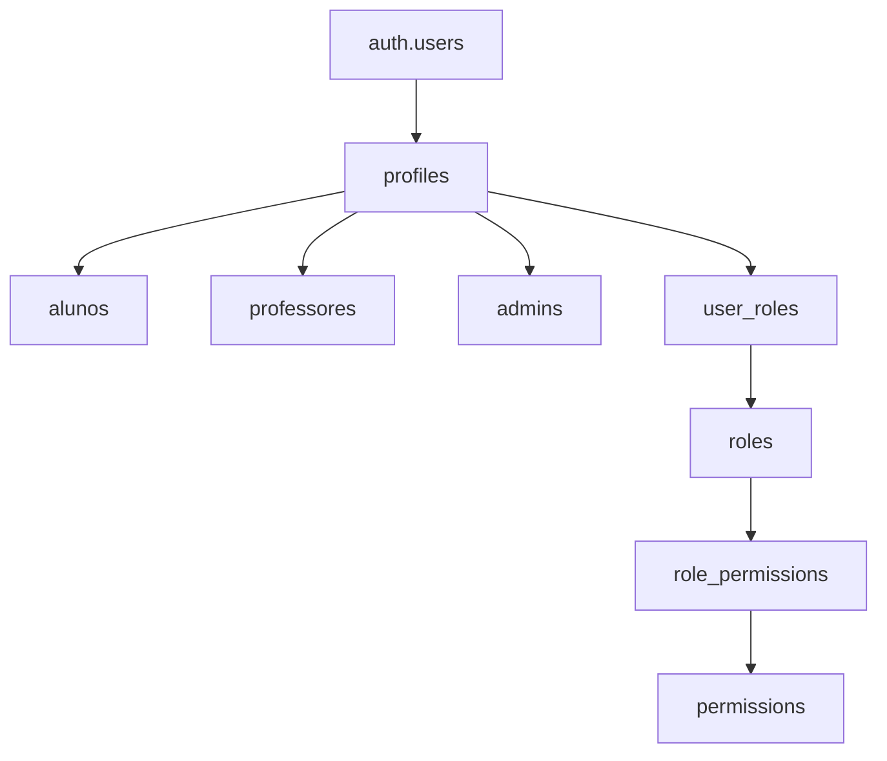
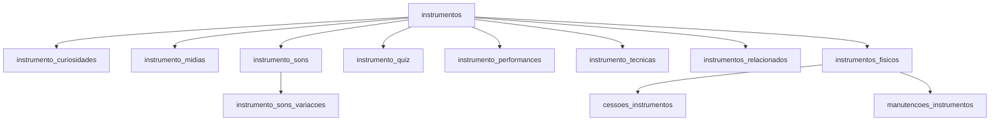
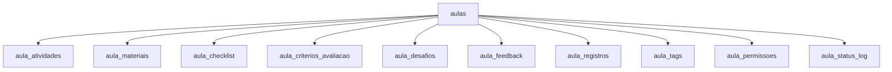
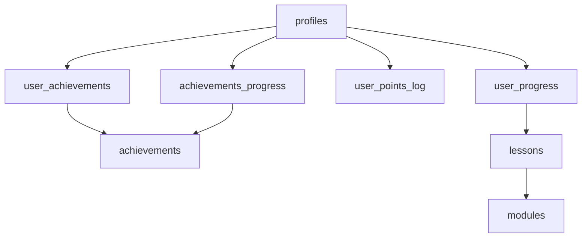
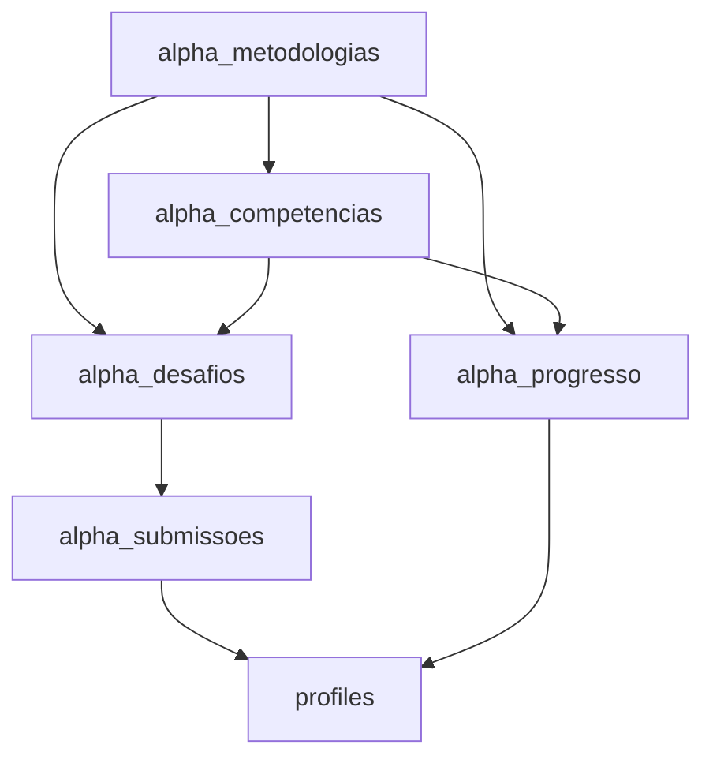
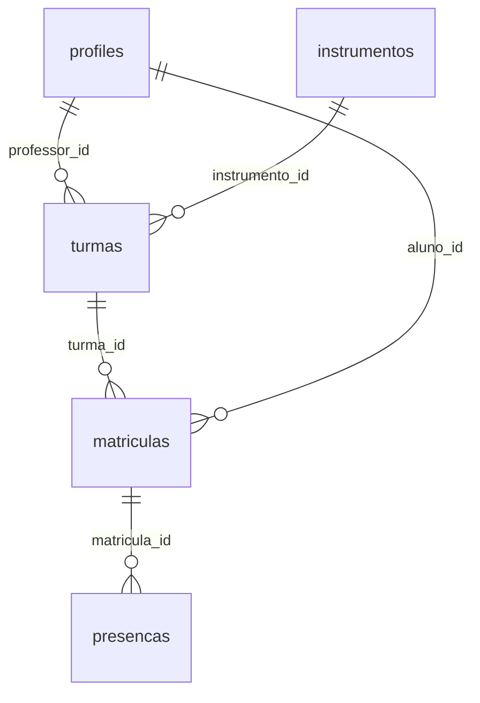
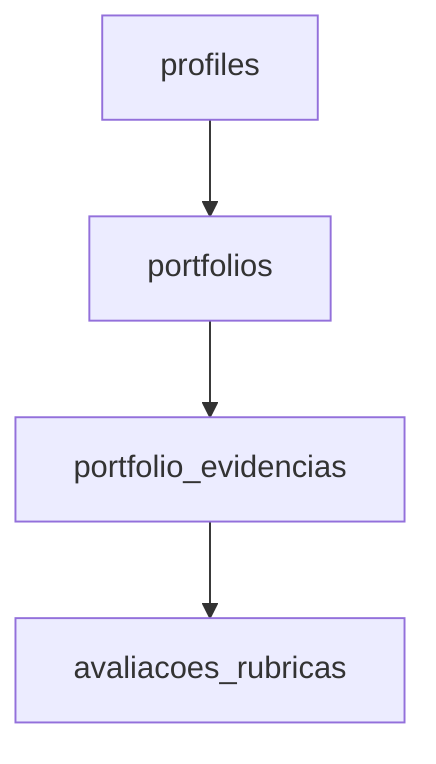
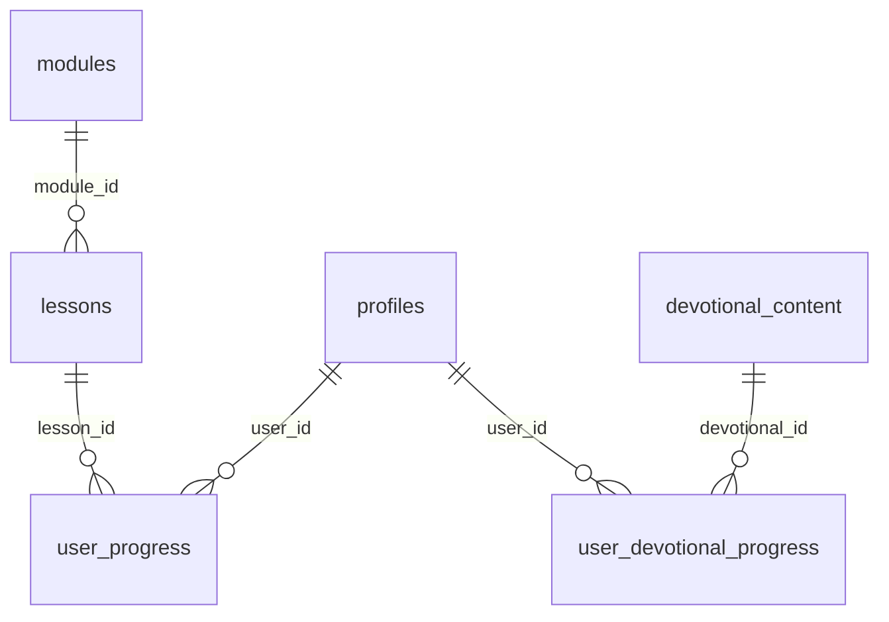

# Banco de Dados - Nipo School

**Referencia definitiva do banco de dados**
**Ultima atualizacao:** 08/10/2025
**Status:** Validado via diagnostico Supabase
**Stack:** PostgreSQL (Supabase) com Row Level Security

---

## Indice

1. [Resumo Executivo](#resumo-executivo)
2. [Arquitetura Geral](#arquitetura-geral)
3. [Schemas do Banco](#schemas-do-banco)
4. [Tabelas - Autenticacao e Perfil](#1-autenticacao-e-perfil)
5. [Tabelas - Gamificacao](#2-gamificacao)
6. [Tabelas - Portfolio](#3-portfolio)
7. [Tabelas - Alpha Desafios](#4-alpha-desafios)
8. [Tabelas - Turmas e Aulas](#5-turmas-e-aulas)
9. [Tabelas - Sistema Educacional Complementar](#6-sistema-educacional-complementar)
10. [Tabelas - Biblioteca de Instrumentos](#7-biblioteca-de-instrumentos)
11. [Tabelas - Instrumentos Fisicos (Gestao do Acervo)](#8-instrumentos-fisicos-gestao-do-acervo)
12. [Tabelas - Comunidade e Interacao](#9-comunidade-e-interacao)
13. [Tabelas - Conteudo Devocional](#10-conteudo-devocional)
14. [Tabelas - Permissoes e Roles](#11-permissoes-e-roles)
15. [Tabelas - Gestao e Administracao](#12-gestao-e-administracao)
16. [Tabelas - Sistema e Auditoria](#13-sistema-e-auditoria)
17. [Views Pre-calculadas](#views-pre-calculadas)
18. [Functions Disponiveis](#functions-disponiveis)
19. [Triggers Automaticos](#triggers-automaticos)
20. [Politicas RLS (Row Level Security)](#politicas-rls)
21. [Interfaces TypeScript](#interfaces-typescript)
22. [Queries e Exemplos de Uso (Hooks)](#queries-e-exemplos-de-uso)
23. [Integracao Frontend](#integracao-frontend)
24. [Diagramas de Relacionamento](#diagramas-de-relacionamento)

---

## Resumo Executivo

| Metrica | Quantidade |
|---------|------------|
| **Tabelas** | 117 |
| **Functions** | 56 |
| **RLS Policies** | 153 |
| **Indices** | 295 |
| **Views** | 24 |
| **Schemas** | public, auth, storage, realtime, finance, integration, legacy |

O Nipo School possui um banco de dados de nivel empresarial implementando um sistema completo para educacao musical com:

- **Sistema de usuarios** robusto (profiles, roles, permissions)
- **Biblioteca de instrumentos** rica e interativa (10 tabelas)
- **Sistema educacional** completo (aulas, turmas, modulos, progressos)
- **Gamificacao avancada** (achievements, pontos, badges, streaks)
- **Portfolio digital** do aluno
- **Alpha Desafios** baseados em metodologias pedagogicas
- **Gestao de acervo** de instrumentos fisicos
- **Recursos unicos** (QR codes, forum, auditoria, devocional)

---

## Arquitetura Geral

### Stack Tecnologica

- **Database**: PostgreSQL (Supabase)
- **Authentication**: Supabase Auth
- **Backend**: Supabase Functions + Triggers
- **Frontend**: React.js / Next.js
- **ORM/Client**: Supabase JavaScript Client
- **Storage**: Supabase Storage (arquivos, imagens, audio)

### Variaveis de Ambiente

```env
NEXT_PUBLIC_SUPABASE_URL=your_supabase_url
NEXT_PUBLIC_SUPABASE_ANON_KEY=your_supabase_anon_key
```

---

## Schemas do Banco

| Schema | Descricao | Tabelas |
|--------|-----------|---------|
| `public` | Schema principal com todas as tabelas da aplicacao | 117 |
| `auth` | Tabelas do Supabase Auth (gerenciadas automaticamente) | 22 |
| `storage` | Gerenciamento de arquivos | - |
| `realtime` | Funcionalidades de tempo real | - |
| `finance` | Sistema financeiro completo | 16 |
| `integration` | Integracoes com sistemas externos | 7 |
| `legacy` | Dados legados (migracao) | 5 |

---

## Categorizacao Completa das Tabelas

### Usuarios e Autenticacao (8 tabelas)

```
profiles                 - Base de todos os usuarios
alunos                   - Extensao para estudantes
professores              - Extensao para educadores
admins                   - Extensao para administradores
usuarios                 - Tabela auxiliar de usuarios
roles                    - Definicao de papeis
permissions              - Permissoes granulares
role_permissions         - Relacionamento roles <-> permissions
```

### Biblioteca de Instrumentos (10 tabelas)

```
instrumentos                    - Catalogo principal
instrumento_curiosidades        - Fatos interessantes
instrumento_midias              - Galeria (fotos, videos, 3D)
instrumento_sons                - Samples de audio
instrumento_sons_variacoes      - Multiplas gravacoes
instrumento_quiz                - Perguntas interativas
instrumento_performances        - Performances famosas
instrumento_tecnicas            - Tecnicas progressivas
instrumentos_relacionados       - Relacionamentos entre instrumentos
instrumentos_fisicos            - Inventario fisico
```

### Sistema Educacional (15 tabelas)

```
aulas                     - Catalogo de aulas
aula_atividades           - Atividades por aula
aula_materiais            - Materiais de apoio
aula_checklist            - Checklists pre/pos aula
aula_criterios_avaliacao  - Criterios de avaliacao
aula_desafios             - Desafios da aula
aula_feedback             - Feedbacks dos professores
aula_registros            - Registros (fotos, videos, atas)
aula_tags                 - Tags organizacionais
turmas                    - Grupos de alunos
matriculas                - Matriculas aluno <-> turma
presencas                 - Controle de presenca
modules                   - Modulos de aprendizado
lessons                   - Licoes por modulo
metodologias_ensino       - Metodologias pedagogicas
```

### Gamificacao e Progresso (8 tabelas)

```
achievements                - Conquistas disponiveis
achievements_educacionais   - Conquistas educacionais especificas
achievements_progress       - Progresso individual nas conquistas
user_achievements           - Conquistas ganhas pelos usuarios
user_progress               - Progresso geral do usuario
user_points_log             - Log de pontuacao
user_devotional_progress    - Progresso devocional
user_notifications          - Notificacoes do usuario
```

### Portfolio (3 tabelas)

```
portfolios              - Portfolios dos alunos
portfolio_evidencias    - Evidencias anexadas
avaliacoes_rubricas     - Avaliacoes por rubricas
```

### Alpha Desafios (5 tabelas)

```
alpha_metodologias      - Metodologias pedagogicas
alpha_competencias      - Competencias por metodologia
alpha_desafios          - Desafios praticos
alpha_submissoes        - Submissoes dos alunos
alpha_progresso         - Progresso nas metodologias
```

### Comunidade e Interacao (6 tabelas)

```
forum_perguntas         - Perguntas do forum
forum_respostas         - Respostas as perguntas
forum_likes             - Likes nas respostas
qr_codes                - QR codes para instrumentos/aulas
qr_scans                - Historico de scans
devotional_content      - Conteudo devocional
```

### Gestao e Administracao (12 tabelas)

```
cessoes_instrumentos        - Emprestimos de instrumentos
historico_instrumentos      - Historico de movimentacao
manutencoes_instrumentos    - Manutencoes dos instrumentos
instrumentos_alunos         - Relacionamento aluno <-> instrumento
professor_instrumentos      - Especialidades dos professores
materiais_apoio             - Biblioteca de materiais
repertorio_musical          - Catalogo musical
sequencias_didaticas        - Sequencias pedagogicas
user_roles                  - Roles dos usuarios
professores_categorias      - Categorias de professores
professores_conteudos       - Conteudos por professor
turma_alunos                - Relacionamento turma <-> aluno
```

### Sistema e Auditoria (9 tabelas)

```
audit_activities           - Log completo de acoes
trigger_logs               - Logs de triggers
migration_log              - Controle de migracoes
hook_cache                 - Cache de hooks
permission_templates       - Templates de permissao
aula_permissoes            - Permissoes especificas por aula
aula_status_log            - Log de status das aulas
desafios_alpha             - Desafios especificos Alpha
desafios_alpha_respostas   - Respostas aos desafios
```

---

## Estrutura Detalhada das Tabelas

---

### 1. AUTENTICACAO E PERFIL

#### 1.0. `auth.users` (Supabase Nativo)

**Descricao:** Tabela gerenciada automaticamente pelo Supabase Auth. NAO modificar diretamente.

```typescript
{
  id: uuid                    // PK
  email: varchar
  encrypted_password: varchar
  created_at: timestamp
  updated_at: timestamp
  email_confirmed_at: timestamp
  last_sign_in_at: timestamp
  raw_app_meta_data: jsonb    // { provider: 'email', providers: ['email'] }
  raw_user_meta_data: jsonb   // { full_name, dob, instrument, tipo_usuario, user_level, theme_preference, notification_enabled, sound_enabled, email_verified, phone_verified }
}
```

---

#### 1.1. `profiles`

**Descricao:** Perfil de todos os usuarios do sistema (alunos, professores, admins). Tabela central do sistema.

**Colunas (26):**

```typescript
{
  id: uuid                    // PK, FK -> auth.users.id
  email: text                 // UNIQUE
  nome: text
  full_name: text
  phone: text
  tipo_usuario: text          // CHECK: 'aluno' | 'professor' | 'admin'
  total_points: integer       // default: 0
  current_streak: integer     // default: 0
  best_streak: integer        // default: 0
  lessons_completed: integer  // default: 0
  modules_completed: integer  // default: 0
  user_level: text            // 'beginner' | 'intermediate' | 'advanced'
  avatar_url: text
  bio: text
  church_name: text
  instrument: text
  joined_at: timestamp        // default: NOW()
  last_active: timestamp      // default: NOW()
  voted_logo: uuid
  has_voted: boolean
  dob: date
  city: text
  state: text
  theme_preference: text      // default: 'light'
  notification_enabled: boolean // default: true
  sound_enabled: boolean      // default: true
}
```

**Nota:** O campo `tipo_usuario` e a fonte de verdade para identificar o papel do usuario. A FK para `auth.users` garante integridade com a autenticacao Supabase.

**RLS Policies:**
- Usuarios veem proprio perfil (`auth.uid() = id`)
- Usuarios inserem proprio perfil
- Usuarios atualizam proprio perfil
- Visualizacao publica para ranking
- Admins veem todos os perfis

**Relacionamentos:**
- `id` -> `auth.users.id` (1:1)
- `id` <- `alunos.id` (1:1)
- `id` <- `professores.id` (1:1)
- `id` <- `admins.id` (1:1)
- `id` <- `user_roles.user_id` (1:N)
- `id` <- `user_achievements.user_id` (1:N)

---

#### 1.2. `alunos`

**Descricao:** Dados especificos dos alunos.

**Colunas (9):**

```typescript
{
  id: uuid                    // PK, FK -> profiles.id
  instrumento: text
  instrumento_id: uuid        // FK -> instrumentos.id
  nivel: text
  turma: text
  data_ingresso: date
  ativo: boolean
  criado_em: timestamp
  // + 2 campos adicionais
}
```

**RLS Policies:**
- Alunos veem proprios dados
- Professores veem alunos de suas turmas
- Admins veem todos

**Relacionamentos:**
- `id` -> `profiles.id` (1:1)
- `instrumento_id` -> `instrumentos.id` (N:1)

---

#### 1.3. `professores`

**Descricao:** Dados especificos dos professores.

**Colunas (6):**

```typescript
{
  id: uuid                    // PK, FK -> profiles.id
  formacao: text
  biografia: text
  especialidades: text[]
  ativo: boolean
  criado_em: timestamp
}
```

**RLS Policies:**
- Professores veem proprios dados
- Admins veem todos

---

#### 1.4. `admins`

**Descricao:** Dados especificos dos administradores.

**Colunas (7):**

```typescript
{
  id: uuid                    // PK, FK -> profiles.id
  nivel_acesso: text
  permissoes: jsonb
  departamento: text
  ativo: boolean
  criado_em: timestamp
  atualizado_em: timestamp
}
```

---

### 2. GAMIFICACAO

#### 2.1. `achievements`

**Descricao:** Conquistas disponiveis no sistema. 24 conquistas ativas no seed inicial.

**Colunas (11):**

```typescript
{
  id: uuid                    // PK
  name: text                  // NOT NULL
  description: text
  badge_icon: text            // URL ou nome do icone / emoji
  badge_color: text           // Cor do badge (#hex), default: '#E53E3E'
  points_reward: integer      // Pontos ao desbloquear, default: 0
  category: text              // 'progress' | 'consistency' | 'social' | 'special' | 'milestone'
  requirement_type: text      // 'lessons_completed' | 'streak_days' | 'points_total' | 'modules_completed' | 'attendance_count'
  requirement_value: integer  // Valor necessario para desbloquear
  is_active: boolean          // default: true
  created_at: timestamp
}
```

**Indices:**
- `idx_achievements_active` ON (is_active)
- `idx_achievements_category` ON (category)
- `idx_achievements_requirement_type` ON (requirement_type)

**RLS Policies:**
- `Achievements are viewable by everyone` (SELECT, public) -> TRUE
- `Anyone can view public achievements` (SELECT, public) -> is_active = true

**Conquistas no seed:**
- **Progresso**: Primeiro Passo -> Mestre Musico (5 conquistas, 10-200 pts)
- **Consistencia**: Fogo Sagrado -> Guerreiro da Fe (3 conquistas, 30-300 pts)
- **Marcos**: Primeiro Modulo -> Doutor em Musica (3 conquistas, 100-500 pts)
- **Especiais**: 13 conquistas variadas

---

#### 2.2. `user_achievements`

**Descricao:** Conquistas desbloqueadas pelos usuarios.

**Colunas (5):**

```typescript
{
  id: uuid                    // PK
  user_id: uuid               // FK -> profiles.id (auth.users.id)
  achievement_id: uuid        // FK -> achievements.id
  earned_at: timestamp        // default: NOW()
  points_earned: integer      // default: 0
}
```

**CONSTRAINT:** UNIQUE (user_id, achievement_id)

**Relacionamentos:**
- `user_id` -> `profiles.id` (N:1)
- `achievement_id` -> `achievements.id` (N:1)

**RLS Policies:**
- Usuarios veem APENAS suas conquistas

---

#### 2.3. `achievements_progress`

**Descricao:** Progresso do usuario em conquistas nao desbloqueadas.

**Colunas (10):**

```typescript
{
  id: uuid                    // PK
  user_id: uuid               // FK -> profiles.id
  achievement_id: uuid        // FK -> achievements.id
  current_progress: integer   // Progresso atual
  target_progress: integer    // Meta para desbloquear
  is_completed: boolean
  completed_at: timestamp
  started_at: timestamp
  updated_at: timestamp
  metadata: jsonb             // Dados adicionais
}
```

**CONSTRAINT:** UNIQUE (user_id, achievement_id)

**Indices:**
- `idx_achievement_progress` ON (user_id, is_completed, updated_at DESC)
- `idx_achievements_progress_user_id` ON (user_id)

---

#### 2.4. `user_points_log`

**Descricao:** Log de todos os pontos ganhos pelo usuario.

**Colunas (10):**

```typescript
{
  id: uuid                    // PK
  user_id: uuid               // FK -> profiles.id
  action: text                // NOT NULL, descricao da acao
  points_earned: integer      // NOT NULL
  multiplier: numeric         // Multiplicador aplicado
  source_type: text           // NOT NULL: 'achievement' | 'lesson' | 'challenge' | 'attendance'
  source_id: uuid             // ID da fonte (achievement_id, lesson_id, etc)
  notes: text
  aula_id: uuid
  created_at: timestamp
}
```

---

#### 2.5. `achievements_educacionais`

**Descricao:** Conquistas educacionais especificas (extensao do sistema de achievements).

---

#### 2.6. `user_progress`

**Descricao:** Progresso geral do usuario em licoes/aulas.

**Colunas:**

```typescript
{
  id: uuid                    // PK
  user_id: uuid               // FK -> auth.users.id
  lesson_id: uuid             // FK -> lessons.id
  started_at: timestamp       // default: NOW()
  completed_at: timestamp     // nullable
  watch_time_seconds: integer // default: 0
  is_completed: boolean       // default: false
  notes: text
  rating: integer             // 1-5
  last_position_seconds: integer // default: 0
  attempts_count: integer     // default: 1
  created_at: timestamp       // default: NOW()
}
```

**CONSTRAINT:** UNIQUE (user_id, lesson_id)

**RLS:**
- Usuarios veem apenas proprios dados
- Usuarios inserem apenas proprios dados
- Usuarios atualizam apenas proprios dados

---

#### 2.7. `user_notifications`

**Descricao:** Notificacoes enviadas aos usuarios.

---

### 3. PORTFOLIO

#### 3.1. `portfolios`

**Descricao:** Portfolios criados pelos alunos.

**Colunas (17):**

```typescript
{
  id: uuid                    // PK
  user_id: uuid               // FK -> profiles.id
  titulo: text                // NOT NULL
  descricao: text
  tipo: text                  // Tipo do portfolio
  status: text                // 'rascunho' | 'em_andamento' | 'concluido'
  visibilidade: text          // 'privado' | 'turma' | 'publico'
  data_inicio: date
  data_fim: date
  tags: text[]
  objetivos: text[]
  reflexao_final: text
  compartilhado_com: uuid[]
  created_at: timestamp
  updated_at: timestamp
  // + 2 campos adicionais
}
```

**RLS Policies:**
- Aluno ve e gerencia APENAS seus portfolios
- Professor ve portfolios de seus alunos (se visibilidade permite)
- Admin ve todos

---

#### 3.2. `portfolio_evidencias`

**Descricao:** Evidencias (fotos, videos, documentos) anexadas aos portfolios.

**Colunas (21):**

```typescript
{
  id: uuid                    // PK
  portfolio_id: uuid          // FK -> portfolios.id
  tipo: text                  // 'imagem' | 'video' | 'audio' | 'documento'
  arquivo_url: text           // NOT NULL, URL no Supabase Storage
  titulo: text
  descricao: text
  tags: text[]
  reflexao: text              // Reflexao do aluno sobre a evidencia
  contexto: text              // Contexto da criacao
  data_criacao: date          // Quando foi criado o trabalho
  competencias: text[]        // Competencias desenvolvidas
  metodologia: text           // Metodologia usada
  feedback_professor: text
  nota: numeric
  ordem: integer              // Ordem de exibicao
  is_destaque: boolean
  metadata: jsonb
  created_at: timestamp
  updated_at: timestamp
  // + 2 campos adicionais
}
```

**Relacionamentos:**
- `portfolio_id` -> `portfolios.id` (N:1)

**RLS Policies:**
- Acesso via portfolio (herda permissoes do portfolio)

---

#### 3.3. `avaliacoes_rubricas`

**Descricao:** Avaliacoes de evidencias usando rubricas.

**Colunas (9):**

```typescript
{
  id: uuid                    // PK
  evidencia_id: uuid          // FK -> portfolio_evidencias.id
  rubrica_id: uuid
  avaliador_id: uuid          // FK -> profiles.id
  criterio: text
  nivel_atingido: integer     // 1-5
  pontuacao: numeric
  feedback: text
  created_at: timestamp
}
```

---

### 4. ALPHA DESAFIOS

#### 4.1. `alpha_metodologias`

**Descricao:** Metodologias pedagogicas (Orff, Kodaly, Dalcroze, Suzuki, etc).

**Colunas (25):**

```typescript
{
  id: uuid                    // PK
  codigo: text                // UNIQUE, NOT NULL. Ex: 'ORFF', 'KODALY'
  nome: text                  // NOT NULL. Ex: 'Metodo Orff-Schulwerk'
  descricao: text
  origem: text                // Pais/regiao de origem
  periodo_desenvolvimento: text
  principios_fundamentais: text[]
  faixa_etaria_ideal: text
  instrumentos_principais: text[]
  tecnicas_ensino: text[]
  repertorio_tipico: text[]
  vantagens: text[]
  desafios: text[]
  aplicacao_brasileira: text
  referencias_bibliograficas: text[]
  videos_demonstrativos: text[]
  recursos_online: text[]
  instituicoes_referencia: text[]
  certificacoes: text[]
  ativo: boolean
  ordem_exibicao: integer
  icon_url: text
  cor_tematica: text          // Cor para UI
  created_at: timestamp
  updated_at: timestamp
}
```

**Indices:**
- `idx_alpha_metodologias_codigo` ON (codigo)
- `idx_alpha_metodologias_ativo` ON (ativo) WHERE ativo = true

**CONSTRAINT:** UNIQUE (codigo)

**RLS Policies:**
- `Metodologias sao visiveis para todos` (SELECT, public) -> ativo = true

---

#### 4.2. `alpha_competencias`

**Descricao:** Competencias desenvolvidas em cada metodologia.

**Colunas (11):**

```typescript
{
  id: uuid                    // PK
  metodologia_id: uuid        // FK -> alpha_metodologias.id
  codigo: text                // Ex: 'ORFF_RITMO_1'
  nome: text                  // NOT NULL
  descricao: text
  categoria: text             // 'ritmica' | 'melodica' | 'harmonica' | 'expressiva'
  nivel: integer              // 1-5
  ordem: integer
  ativo: boolean
  created_at: timestamp
  updated_at: timestamp
}
```

**Indices:**
- `idx_alpha_competencias_metodologia` ON (metodologia_id)

---

#### 4.3. `alpha_desafios`

**Descricao:** Desafios praticos baseados nas metodologias.

**Colunas (21):**

```typescript
{
  id: uuid                    // PK
  codigo: text                // UNIQUE. Ex: 'ORFF_RITMO_001'
  titulo: text                // NOT NULL
  descricao: text             // NOT NULL
  objetivos: text[]           // NOT NULL, objetivos de aprendizagem
  dificuldade: integer        // 1-5
  pontos_base: integer        // Pontos ao completar
  tipo_evidencia: text        // 'video' | 'audio' | 'imagem' | 'documento'
  instrucoes: text
  recursos_necessarios: text[] // Materiais necessarios
  tempo_estimado: integer     // Minutos
  tags: text[]
  categoria: text
  metodologia_id: uuid        // FK -> alpha_metodologias.id
  competencia_id: uuid        // FK -> alpha_competencias.id
  nivel_serie: text           // Serie/nivel recomendado
  exemplos_url: text[]        // URLs de exemplos
  ativo: boolean
  ordem_exibicao: integer
  created_at: timestamp
  updated_at: timestamp
}
```

**Indices:**
- `idx_alpha_desafios_competencia` ON (competencia_id)
- `idx_alpha_desafios_metodologia` ON (metodologia_id)
- `idx_alpha_desafios_search` ON GIN(to_tsvector('portuguese', titulo || ' ' || descricao))

**RLS Policies:**
- `Desafios sao visiveis para todos` (SELECT, public) -> ativo = true

---

#### 4.4. `alpha_submissoes`

**Descricao:** Submissoes de desafios feitas pelos alunos.

**Colunas (17):**

```typescript
{
  id: uuid                    // PK
  user_id: uuid               // FK -> profiles.id
  desafio_id: uuid            // FK -> alpha_desafios.id
  evidencia_url: text         // NOT NULL, URL do arquivo no Storage
  evidencia_tipo: text        // Tipo do arquivo
  reflexao: text              // Reflexao do aluno
  dificuldades: text          // Dificuldades encontradas
  aprendizados: text          // O que aprendeu
  status: text                // 'pendente' | 'avaliada' | 'rejeitada'
  nota: numeric               // Nota atribuida
  feedback: text              // Feedback do professor
  pontos_ganhos: integer
  avaliada_em: timestamp
  avaliador_id: uuid          // FK -> profiles.id
  tentativa: integer          // Numero da tentativa
  created_at: timestamp
  updated_at: timestamp
}
```

**Indices:**
- `idx_alpha_submissoes_desafio` ON (desafio_id)
- `idx_alpha_submissoes_status` ON (status)
- `idx_alpha_submissoes_user` ON (user_id)
- `idx_alpha_submissoes_user_id` ON (user_id)

**RLS Policies (6):**
1. `Aluno ve proprias submissoes alpha` (SELECT) -> user_id = auth.uid()
2. `Aluno cria proprias submissoes alpha` (INSERT)
3. `Admin ve todas submissoes` (ALL) -> is_admin(auth.uid())
4. `Admin gerencia todas submissoes alpha` (ALL) -> is_admin(auth.uid())
5. `Professor ve submissoes de seus alunos` (SELECT) -> is_professor_of_student(user_id)
6. `Professor avalia submissoes de seus alunos` (UPDATE) -> is_professor_of_student(user_id)

---

#### 4.5. `alpha_progresso`

**Descricao:** Progresso do aluno nas metodologias e competencias.

**Colunas (12):**

```typescript
{
  id: uuid                    // PK
  user_id: uuid               // FK -> profiles.id
  metodologia_id: uuid        // FK -> alpha_metodologias.id
  competencia_id: uuid        // FK -> alpha_competencias.id
  nivel_atual: integer        // Nivel alcancado (1-5)
  desafios_concluidos: integer
  desafios_total: integer
  pontos_acumulados: integer
  ultima_atividade: timestamp
  percentual_conclusao: numeric // 0-100
  created_at: timestamp
  updated_at: timestamp
}
```

**CONSTRAINT:** UNIQUE (user_id, metodologia_id, competencia_id)

**Indices:**
- `idx_alpha_progresso_user` ON (user_id)

---

### 5. TURMAS E AULAS

#### 5.1. `turmas`

**Descricao:** Turmas de aulas.

**Colunas (21):**

```typescript
{
  id: uuid                    // PK
  nome: text                  // NOT NULL
  descricao: text
  professor_id: uuid          // FK -> profiles.id, NOT NULL
  instrumento_id: uuid        // FK -> instrumentos.id, NOT NULL
  nivel: text                 // NOT NULL: 'iniciante' | 'intermediario' | 'avancado'
  max_alunos: integer
  min_alunos: integer
  valor_mensalidade: numeric
  horarios: jsonb             // [{dia: 'segunda', hora_inicio: '14:00', hora_fim: '15:30'}]
  status: text                // 'ativa' | 'inativa' | 'encerrada'
  data_inicio: date
  data_fim: date
  observacoes: text
  modalidade: text            // 'presencial' | 'online' | 'hibrido'
  local: text
  material_necessario: text
  pre_requisitos: text
  ativo: boolean
  criado_em: timestamp
  atualizado_em: timestamp
}
```

**RLS Policies:**
- Professor gerencia suas turmas
- Aluno ve turmas em que esta matriculado
- Admin ve todas

---

#### 5.2. `matriculas`

**Descricao:** Matriculas de alunos em turmas.

**Colunas (15):**

```typescript
{
  id: uuid                    // PK
  turma_id: uuid              // FK -> turmas.id, NOT NULL
  aluno_id: uuid              // FK -> profiles.id, NOT NULL
  status: text                // 'ativa' | 'inativa' | 'concluida' | 'cancelada'
  data_matricula: date
  data_inicio_aulas: date
  data_cancelamento: date
  motivo_cancelamento: text
  valor_acordado: numeric
  desconto_aplicado: numeric
  forma_pagamento: text
  observacoes: text
  notas_professor: text
  criado_em: timestamp
  atualizado_em: timestamp
}
```

**RLS Policies:**
- Aluno ve apenas suas matriculas
- Professor ve matriculas de suas turmas
- Admin ve todas

---

#### 5.3. `aulas`

**Descricao:** Aulas planejadas/realizadas.

**Colunas (14):**

```typescript
{
  id: uuid                    // PK
  numero: integer             // NOT NULL, numero da aula na sequencia
  titulo: text                // NOT NULL
  modulo_id: uuid
  data_programada: date       // NOT NULL
  objetivo_didatico: text
  resumo_atividades: text
  desafio_alpha: text         // Desafio proposto
  nivel: text                 // CHECK: 'iniciante' | 'intermediario' | 'avancado'
  formato: text               // 'teorica' | 'pratica' | 'mista'
  status: text                // 'planejada' | 'em_andamento' | 'realizada' | 'cancelada'
  criado_em: timestamp
  responsavel_id: uuid        // FK -> profiles.id
  detalhes_aula: jsonb
}
```

**RLS Policies:**
- Professor ve e gerencia suas aulas
- Aluno ve aulas de suas turmas
- Admin ve todas

---

#### 5.4. `presencas`

**Descricao:** Registro de presenca nas aulas.

**Colunas (7):**

```typescript
{
  id: uuid                    // PK
  matricula_id: uuid          // FK -> matriculas.id, NOT NULL
  data_aula: date             // NOT NULL
  presente: boolean
  justificativa: text
  observacoes: text
  criado_em: timestamp
}
```

---

#### 5.5. Tabelas auxiliares de aulas

**`aula_atividades`** - Atividades por aula
**`aula_materiais`** - Materiais de apoio
**`aula_checklist`** - Checklists pre/pos aula
**`aula_criterios_avaliacao`** - Criterios de avaliacao
**`aula_desafios`** - Desafios da aula
**`aula_feedback`** - Feedbacks dos professores
**`aula_registros`** - Registros (fotos, videos, atas)
**`aula_tags`** - Tags organizacionais
**`aula_permissoes`** - Permissoes especificas por aula
**`aula_status_log`** - Log de status das aulas

Todas estas tabelas possuem FK `aula_id -> aulas.id` e colunas especificas para seu dominio.

---

### 6. SISTEMA EDUCACIONAL COMPLEMENTAR

#### 6.1. `modules`

**Descricao:** Modulos de aprendizado. 10 modulos no seed inicial.

```typescript
{
  id: uuid                    // PK
  title: text                 // NOT NULL
  description: text
  slug: text                  // UNIQUE
  thumbnail_url: text
  level_required: text        // 'beginner' | 'intermediate' | 'advanced'
  instrument_category: text   // 'teclado' | 'bateria' | 'violao' | 'baixo' | 'voz' | 'teoria' | 'all'
  duration_hours: integer     // default: 0
  lessons_count: integer      // default: 0 (atualizado por trigger)
  order_index: integer        // default: 0
  is_active: boolean          // default: true
  is_premium: boolean         // default: false
  created_at: timestamp
  updated_at: timestamp
}
```

**Modulos no seed:**
- Introducao ao Teclado (Iniciante)
- Teoria Musical Basica (Iniciante)
- Bateria Gospel (Iniciante)
- Violao para Louvor (Iniciante)
- Teclado Gospel Intermediario (Premium)
- Harmonia Funcional (Premium)
- Tecnicas de Baixo Gospel (Premium)
- Improvisacao no Teclado (Avancado, Premium)
- Arranjos Vocais (Avancado, Premium)
- Producao Musical Gospel (Avancado, Premium)

---

#### 6.2. `lessons`

**Descricao:** Licoes individuais dentro de modulos. 7 licoes no seed inicial.

```typescript
{
  id: uuid                    // PK
  module_id: uuid             // FK -> modules.id
  title: text                 // NOT NULL
  description: text
  slug: text
  video_url: text
  video_duration_seconds: integer // default: 0
  thumbnail_url: text
  order_index: integer        // default: 0
  is_free: boolean            // default: false
  has_exercise: boolean       // default: false
  pdf_materials: jsonb        // default: []
  audio_files: jsonb          // default: []
  tags: text[]                // default: {}
  created_at: timestamp
  updated_at: timestamp
}
```

**CONSTRAINT:** UNIQUE (module_id, slug)

---

### 7. BIBLIOTECA DE INSTRUMENTOS

#### 7.1. `instrumentos`

**Descricao:** Catalogo de instrumentos musicais.

**Colunas (16):**

```typescript
{
  id: uuid                    // PK
  nome: text                  // NOT NULL
  categoria: text             // 'cordas' | 'sopro' | 'percussao' | 'teclado' | 'vocal' | 'teoria' | 'outros'
  descricao: text
  imagem_url: text
  historia: text
  origem: text                // Pais/regiao de origem
  familia_instrumental: text  // Familia do instrumento
  material_principal: text    // Material de construcao
  tecnica_producao_som: text
  dificuldade_aprendizado: text // 'facil' | 'moderado' | 'dificil'
  anatomia_partes: jsonb      // Partes do instrumento
  curiosidades: jsonb         // Array de curiosidades
  ativo: boolean
  ordem_exibicao: integer
  criado_em: timestamp
}
```

**RLS Policies:**
- Todos veem instrumentos ativos
- Admin gerencia instrumentos

**Relacionamentos:**
- `id` <- `instrumento_curiosidades.instrumento_id` (1:N)
- `id` <- `instrumento_midias.instrumento_id` (1:N)
- `id` <- `instrumento_sons.instrumento_id` (1:N)
- `id` <- `instrumento_quiz.instrumento_id` (1:N)
- `id` <- `instrumento_performances.instrumento_id` (1:N)
- `id` <- `instrumento_tecnicas.instrumento_id` (1:N)
- `id` <- `instrumentos_relacionados.instrumento_id` (1:N)
- `id` <- `instrumentos_fisicos.instrumento_id` (1:N)

---

#### 7.2. `instrumento_curiosidades`

**Descricao:** Curiosidades sobre instrumentos.

**Colunas (9):**

```typescript
{
  id: uuid                    // PK
  instrumento_id: uuid        // FK -> instrumentos.id
  titulo: text
  conteudo: text
  categoria: text             // 'historica' | 'tecnica' | 'cultural'
  imagem_url: text
  fonte: text
  ordem: integer
  created_at: timestamp
}
```

---

#### 7.3. `instrumento_midias`

**Descricao:** Videos e audios demonstrativos.

**Colunas (18):**

```typescript
{
  id: uuid                    // PK
  instrumento_id: uuid        // FK -> instrumentos.id
  tipo: text                  // 'video' | 'audio'
  titulo: text
  descricao: text
  url: text                   // NOT NULL
  thumbnail_url: text
  duracao_segundos: integer
  artista_performer: text
  obra: text
  compositor: text
  ano_gravacao: integer
  qualidade: text             // 'SD' | 'HD' | '4K'
  tags: text[]
  visualizacoes: integer
  ordem: integer
  ativo: boolean
  created_at: timestamp
}
```

---

#### 7.4. `instrumento_sons`

**Descricao:** Samples de audio dos instrumentos.

**Colunas (11):**

```typescript
{
  id: uuid                    // PK
  instrumento_id: uuid        // FK -> instrumentos.id
  nota_musical: text          // Ex: 'C4', 'D#5'
  tecnica: text               // Ex: 'pizzicato', 'legato'
  dinamica: text              // 'pp' | 'p' | 'mf' | 'f' | 'ff'
  arquivo_audio: text         // NOT NULL
  waveform_data: jsonb        // Dados para exibir forma de onda
  bpm: integer
  tonalidade: text
  artista_performer: text
  created_at: timestamp
}
```

---

#### 7.5. `instrumento_sons_variacoes`

**Descricao:** Variacoes de samples (multiplas gravacoes da mesma nota).

**Colunas (10):**

```typescript
{
  id: uuid                    // PK
  som_id: uuid                // FK -> instrumento_sons.id
  arquivo_audio: text         // NOT NULL
  artista_performer: text
  qualidade_gravacao: text    // 'studio' | 'live' | 'demo'
  instrumento_usado: text     // Marca/modelo especifico
  local_gravacao: text
  ano_gravacao: integer
  duracao_segundos: integer
  created_at: timestamp
}
```

---

#### 7.6. `instrumento_tecnicas`

**Descricao:** Tecnicas de execucao.

**Colunas (14):**

```typescript
{
  id: uuid                    // PK
  instrumento_id: uuid        // FK -> instrumentos.id
  nome: text                  // NOT NULL. Ex: 'Pizzicato', 'Staccato'
  descricao: text
  dificuldade: text           // 'basica' | 'intermediaria' | 'avancada'
  video_demonstracao: text
  imagem_diagrama: text
  instrucoes_passo_passo: text[]
  dicas: text[]
  exercicios_sugeridos: text[]
  musicas_que_usam: text[]
  ordem: integer
  ativo: boolean
  created_at: timestamp
}
```

---

#### 7.7. `instrumento_quiz`

**Descricao:** Perguntas de quiz sobre instrumentos.

**Colunas (15):**

```typescript
{
  id: uuid                    // PK
  instrumento_id: uuid        // FK -> instrumentos.id
  pergunta: text              // NOT NULL
  tipo: text                  // 'multipla_escolha' | 'verdadeiro_falso' | 'audio'
  opcoes: jsonb               // Array de opcoes
  resposta_correta: text
  explicacao: text
  dificuldade: integer        // 1-5
  audio_url: text             // Para quiz de reconhecimento de som
  pontos: integer
  ordem: integer
  tags: text[]
  ativo: boolean
  created_at: timestamp
  updated_at: timestamp
}
```

---

#### 7.8. `instrumento_performances`

**Descricao:** Performances notaveis com o instrumento.

**Colunas (14):**

```typescript
{
  id: uuid                    // PK
  instrumento_id: uuid        // FK -> instrumentos.id
  titulo: text                // NOT NULL
  artista: text               // NOT NULL
  obra: text
  compositor: text
  video_url: text
  ano: integer
  evento: text                // Concerto, festival, etc
  local: text
  descricao: text
  destaque: boolean
  ordem: integer
  created_at: timestamp
}
```

---

#### 7.9. `instrumentos_relacionados`

**Descricao:** Relacoes entre instrumentos (similares, mesma familia, etc).

**Colunas (7):**

```typescript
{
  id: uuid                    // PK
  instrumento_id: uuid        // FK -> instrumentos.id
  relacionado_id: uuid        // FK -> instrumentos.id
  tipo_relacao: text          // 'similar' | 'mesma_familia' | 'complementar'
  descricao_relacao: text
  similaridade_score: numeric // 0-100
  created_at: timestamp
}
```

---

### 8. INSTRUMENTOS FISICOS (GESTAO DO ACERVO)

#### 8.1. `instrumentos_fisicos`

**Descricao:** Instrumentos fisicos do acervo da escola.

**Colunas (15):**

```typescript
{
  id: uuid                    // PK
  instrumento_id: uuid        // FK -> instrumentos.id
  codigo_patrimonio: text     // UNIQUE
  marca: text
  modelo: text
  numero_serie: text
  ano_fabricacao: integer
  estado_conservacao: text    // 'excelente' | 'bom' | 'regular' | 'ruim'
  valor_aquisicao: numeric
  data_aquisicao: date
  localizacao: text           // Sala onde esta
  status: text                // 'disponivel' | 'emprestado' | 'manutencao' | 'baixado'
  observacoes: text
  created_at: timestamp
  updated_at: timestamp
}
```

---

#### 8.2. `cessoes_instrumentos`

**Descricao:** Emprestimos de instrumentos para alunos.

**Colunas (15):**

```typescript
{
  id: uuid                    // PK
  instrumento_fisico_id: uuid // FK -> instrumentos_fisicos.id
  aluno_id: uuid              // FK -> profiles.id
  data_inicio: date           // NOT NULL
  data_prevista_devolucao: date
  data_devolucao: date
  status: text                // 'ativa' | 'devolvido' | 'atrasado'
  termo_responsabilidade: text // URL do termo assinado
  condicao_emprestimo: text
  condicao_devolucao: text
  observacoes: text
  valor_caucao: numeric
  responsavel_emprestimo: uuid
  created_at: timestamp
  updated_at: timestamp
}
```

**Indices:**
- `idx_cessoes_aluno_id` ON (aluno_id)
- `idx_cessoes_data_inicio` ON (data_inicio)
- `idx_cessoes_instrumento_fisico_id` ON (instrumento_fisico_id)

---

#### 8.3. `manutencoes_instrumentos`

**Descricao:** Historico de manutencoes.

**Colunas (14):**

```typescript
{
  id: uuid                    // PK
  instrumento_fisico_id: uuid // FK -> instrumentos_fisicos.id
  tipo: text                  // 'preventiva' | 'corretiva' | 'limpeza'
  data_manutencao: date       // NOT NULL
  descricao: text             // NOT NULL
  problema_relatado: text
  solucao_aplicada: text
  pecas_trocadas: text[]
  custo: numeric
  responsavel: text           // Tecnico/empresa
  proxima_manutencao: date
  observacoes: text
  created_at: timestamp
  updated_at: timestamp
}
```

---

### 9. COMUNIDADE E INTERACAO

#### 9.1. `forum_perguntas`

**Descricao:** Perguntas do forum da comunidade.

#### 9.2. `forum_respostas`

**Descricao:** Respostas as perguntas do forum.

#### 9.3. `forum_likes`

**Descricao:** Likes nas respostas do forum.

#### 9.4. `qr_codes`

**Descricao:** QR codes para instrumentos e aulas.

#### 9.5. `qr_scans`

**Descricao:** Historico de leituras de QR codes.

---

### 10. CONTEUDO DEVOCIONAL

#### 10.1. `devotional_content`

**Descricao:** Conteudo devocional. 7 devocionais no seed inicial.

```typescript
{
  id: uuid                    // PK
  title: text                 // NOT NULL
  content: text               // NOT NULL
  bible_verse: text
  bible_reference: text
  author: text                // default: 'Pastor'
  category: text              // 'daily' | 'musician_story' | 'worship_study' | 'prayer' | 'testimony'
  featured_image_url: text
  published_date: date        // default: CURRENT_DATE
  is_published: boolean       // default: false
  view_count: integer         // default: 0
  created_at: timestamp
}
```

---

#### 10.2. `user_devotional_progress`

**Descricao:** Progresso devocional do usuario.

```typescript
{
  id: uuid                    // PK
  user_id: uuid               // FK -> auth.users.id
  devotional_id: uuid         // FK -> devotional_content.id
  read_at: timestamp          // default: NOW()
  is_favorite: boolean        // default: false
  personal_notes: text
}
```

**CONSTRAINT:** UNIQUE (user_id, devotional_id)

---

### 11. PERMISSOES E ROLES

#### 11.1. `user_roles`

**Descricao:** Papeis dos usuarios (permite multiplos papeis por usuario).

```typescript
{
  id: uuid                    // PK, default: gen_random_uuid()
  user_id: uuid               // FK -> auth.users.id
  role_type: text             // NOT NULL, CHECK: 'admin' | 'professor' | 'aluno'
  is_active: boolean          // default: true
  created_at: timestamp       // default: now()
  updated_at: timestamp       // default: now()
}
```

**Nota:** Pode parecer redundante com `profiles.tipo_usuario`, mas permite multiplos papeis por usuario (ex: professor + admin).

#### 11.2. `roles`

**Descricao:** Definicao de papeis disponiveis no sistema.

#### 11.3. `permissions`

**Descricao:** Permissoes granulares.

#### 11.4. `role_permissions`

**Descricao:** Relacionamento roles <-> permissions.

#### 11.5. `permission_templates`

**Descricao:** Templates de permissao pre-configurados.

**Sistema de Roles do Supabase:**
```
authenticated    - Usuarios autenticados
anon             - Usuarios anonimos
service_role     - Role de servico
postgres         - Administrador total
supabase_*       - Roles especificas do Supabase
```

---

### 12. GESTAO E ADMINISTRACAO

#### 12.1. `professor_instrumentos`

**Descricao:** Especialidades dos professores em instrumentos.

```typescript
{
  professor_id: uuid          // FK -> professores.id
  instrumento_id: uuid        // FK -> instrumentos.id
  nivel_ensino: text          // 'iniciante' | 'intermediario' | 'avancado' | 'todos'
  anos_experiencia: integer
}
```

#### 12.2. `instrumentos_alunos`

**Descricao:** Relacionamento aluno <-> instrumento.

#### 12.3. `historico_instrumentos`

**Descricao:** Historico de movimentacao dos instrumentos.

#### 12.4. `materiais_apoio`

**Descricao:** Biblioteca de materiais pedagogicos.

#### 12.5. `repertorio_musical`

**Descricao:** Catalogo de repertorio musical.

#### 12.6. `sequencias_didaticas`

**Descricao:** Sequencias pedagogicas.

#### 12.7. `metodologias_ensino`

**Descricao:** Metodologias pedagogicas (tabela complementar a alpha_metodologias).

#### 12.8. `professores_categorias`

**Descricao:** Categorias de professores.

#### 12.9. `professores_conteudos`

**Descricao:** Conteudos por professor.

#### 12.10. `turma_alunos`

**Descricao:** Relacionamento turma <-> aluno.

#### 12.11. `usuarios`

**Descricao:** Tabela auxiliar de usuarios.

---

### 13. SISTEMA E AUDITORIA

#### 13.1. `audit_activities`

**Descricao:** Log completo de acoes no sistema.

#### 13.2. `trigger_logs`

**Descricao:** Logs de triggers executados.

#### 13.3. `migration_log`

**Descricao:** Controle de migracoes do banco.

#### 13.4. `hook_cache`

**Descricao:** Cache de hooks.

#### 13.5. `desafios_alpha`

**Descricao:** Desafios especificos Alpha (tabela legada, usar `alpha_desafios`).

#### 13.6. `desafios_alpha_respostas`

**Descricao:** Respostas aos desafios Alpha (tabela legada, usar `alpha_submissoes`).

---

## Views Pre-calculadas

O banco possui 24 views pre-calculadas para otimizar consultas frequentes.

### `view_dashboard_aluno`

**Descricao:** Metricas consolidadas do aluno. VIEW PRINCIPAL para o dashboard do aluno.

**Colunas retornadas:**

```typescript
{
  id: uuid
  full_name: text
  total_points: integer
  current_streak: integer
  best_streak: integer
  lessons_completed: integer
  modules_completed: integer
  total_achievements: bigint
  achievements_last_week: bigint
  total_portfolios: bigint
  total_submissoes: bigint
  submissoes_avaliadas: bigint
}
```

**SQL da View:**

```sql
SELECT
  p.id,
  p.full_name,
  p.total_points,
  p.current_streak,
  p.best_streak,
  p.lessons_completed,
  p.modules_completed,
  COUNT(DISTINCT ua.achievement_id) as total_achievements,
  COUNT(DISTINCT ua.achievement_id) FILTER (WHERE ua.earned_at > NOW() - INTERVAL '7 days') as achievements_last_week,
  COUNT(DISTINCT po.id) as total_portfolios,
  COUNT(DISTINCT asub.id) as total_submissoes,
  COUNT(DISTINCT asub.id) FILTER (WHERE asub.status = 'avaliada') as submissoes_avaliadas
FROM profiles p
LEFT JOIN user_achievements ua ON ua.user_id = p.id
LEFT JOIN portfolios po ON po.user_id = p.id
LEFT JOIN alpha_submissoes asub ON asub.user_id = p.id
WHERE p.tipo_usuario = 'aluno'
GROUP BY p.id;
```

---

### `view_dashboard_professor`

**Descricao:** Metricas do professor.

**Colunas:**

```typescript
{
  id: uuid
  full_name: text
  total_turmas: bigint
  total_alunos: bigint
  submissoes_pendentes: bigint
  taxa_presenca: numeric
}
```

---

### `view_admin_dashboard`

**Descricao:** Metricas globais para admin.

---

### Outras Views

| View | Descricao |
|------|-----------|
| `view_attendance_analytics` | Analytics de presenca |
| `view_aulas_admin` | Visao de aulas para admin |
| `view_aulas_aluno` | Aulas liberadas para aluno |
| `view_aulas_professor` | Aulas do professor |
| `view_user_gamification` | Gamificacao completa do usuario |
| `view_qr_analytics` | Analytics de QR codes |

---

## Functions Disponiveis

O banco possui 56 functions. As principais:

### Verificacao de Roles

#### `is_admin(user_id uuid) -> boolean`
Verifica se usuario e admin.

#### `is_professor_of_student(student_id uuid) -> boolean`
Verifica se o professor autenticado e responsavel pelo aluno.

### Gamificacao

#### `add_user_points(user_id uuid, points integer, action text, source_type text, source_id uuid) -> boolean`
Adiciona pontos ao usuario com log automatico.

#### `award_points(user_id uuid, points integer, reason text) -> jsonb`
Premia usuario com pontos.

#### `check_and_grant_achievements(user_id uuid) -> integer`
Verifica e concede conquistas automaticamente. Retorna quantidade de conquistas concedidas.

#### `calculate_user_achievements(user_id uuid) -> jsonb`
Calcula progresso de conquistas.

### Estatisticas

#### `get_user_stats(user_id uuid) -> jsonb`
Retorna estatisticas completas do usuario.

### QR Codes

#### `generate_qr_code(type text, reference_id uuid, metadata jsonb) -> jsonb`
Gera QR code.

#### `process_qr_scan(code text, user_id uuid) -> jsonb`
Processa leitura de QR code.

### Streak

#### `update_user_streak(user_id uuid, new_streak integer) -> void`
Atualiza sequencia do usuario.

---

## Triggers Automaticos

| Trigger | Descricao |
|---------|-----------|
| Criacao de perfil | Ao cadastrar no auth, perfil e criado automaticamente |
| Insercao em tabela especifica | Aluno/Professor criado automaticamente conforme tipo_usuario |
| Atualizacao de contadores | lessons_count em modules, etc |
| Atualizacao de `updated_at` | Em modulos e aulas |
| Atualizacao de `last_active` | No perfil, ao registrar atividade |
| Logs de auditoria | Registra erros e sucessos em audit_activities |
| Contador de aulas por modulo | Automatico ao inserir/remover lessons |

---

## Politicas RLS

O banco possui 153 politicas RLS (Row Level Security) distribuidas por todas as tabelas.

### Padrao Geral de Policies

| Papel | Padrao de Acesso |
|-------|-----------------|
| **Aluno** | Ve/edita apenas seus proprios dados |
| **Professor** | Ve seus dados + dados de alunos de suas turmas |
| **Admin** | Acesso total (via funcao `is_admin()`) |
| **Publico** | Acesso de leitura a dados marcados como ativos/publicos |

### Policies por Tabela (Principais)

**profiles:**
- `profile_select_own` - SELECT onde `auth.uid() = id`
- `profile_update_own` - UPDATE onde `auth.uid() = id`
- `profiles_insert_via_trigger` - INSERT publico (via trigger de cadastro)
- Visualizacao publica para ranking

**achievements:**
- `Achievements are viewable by everyone` - SELECT publico
- `Anyone can view public achievements` - SELECT onde `is_active = true`

**alpha_submissoes:**
- `Aluno ve proprias submissoes alpha` - SELECT onde `user_id = auth.uid()`
- `Aluno cria proprias submissoes alpha` - INSERT
- `Admin ve todas submissoes` - ALL onde `is_admin(auth.uid())`
- `Professor ve submissoes de seus alunos` - SELECT onde `is_professor_of_student(user_id)`
- `Professor avalia submissoes de seus alunos` - UPDATE onde `is_professor_of_student(user_id)`

**user_progress:**
- Usuarios veem apenas proprios dados
- Usuarios inserem apenas proprios dados
- Usuarios atualizam apenas proprios dados

**turmas:**
- Professor gerencia suas turmas
- Aluno ve turmas em que esta matriculado
- Admin ve todas

---

## Interfaces TypeScript

### AuthUser

```typescript
interface AuthUser {
  id: string;
  email: string;
  email_confirmed_at?: Date;
  created_at: Date;
  updated_at: Date;
  last_sign_in_at?: Date;
  raw_user_meta_data: {
    full_name: string;
    dob: string;
    instrument: string;
    tipo_usuario: 'aluno' | 'professor' | 'admin';
    user_level: 'beginner' | 'intermediate' | 'advanced';
    theme_preference: 'light' | 'dark';
    notification_enabled: boolean;
    sound_enabled: boolean;
    email_verified: boolean;
    phone_verified: boolean;
  };
  raw_app_meta_data: {
    provider: string;
    providers: string[];
  };
}
```

### Profile

```typescript
interface Profile {
  id: string;
  email: string;
  nome: string;
  full_name: string;
  phone: string;
  tipo_usuario: 'aluno' | 'professor' | 'admin';
  total_points: number;
  current_streak: number;
  best_streak: number;
  lessons_completed: number;
  modules_completed: number;
  user_level: 'beginner' | 'intermediate' | 'advanced';
  avatar_url?: string;
  bio?: string;
  church_name?: string;
  instrument?: string;
  joined_at: Date;
  last_active: Date;
  voted_logo?: string;
  has_voted: boolean;
  dob?: Date;
  city?: string;
  state?: string;
  theme_preference: 'light' | 'dark';
  notification_enabled: boolean;
  sound_enabled: boolean;
}
```

### Aluno

```typescript
interface Aluno {
  id: string;
  instrumento_id?: string;
  instrumento?: string;
  nivel: string;
  turma?: string;
  data_ingresso: Date;
  ativo: boolean;
  criado_em: Date;
  // Relacionamentos
  profile?: Profile;
  instrumento_ref?: Instrumento;
}
```

### Professor

```typescript
interface Professor {
  id: string;
  formacao?: string;
  biografia?: string;
  especialidades: string[];
  ativo: boolean;
  criado_em: Date;
  // Relacionamentos
  profile?: Profile;
  instrumentos?: ProfessorInstrumento[];
}

interface ProfessorInstrumento {
  professor_id: string;
  instrumento_id: string;
  nivel_ensino: 'iniciante' | 'intermediario' | 'avancado' | 'todos';
  anos_experiencia: number;
  instrumento?: Instrumento;
}
```

### Admin

```typescript
interface Admin {
  id: string;
  nivel_acesso: string;
  permissoes: Record<string, any>;
  departamento: string;
  ativo: boolean;
  criado_em: Date;
  atualizado_em: Date;
}
```

### Achievement

```typescript
interface Achievement {
  id: string;
  name: string;
  description: string;
  badge_icon: string;
  badge_color: string;
  points_reward: number;
  category: 'progress' | 'consistency' | 'social' | 'special' | 'milestone';
  requirement_type: 'lessons_completed' | 'streak_days' | 'points_total' | 'modules_completed' | 'attendance_count';
  requirement_value: number;
  is_active: boolean;
  created_at: Date;
}
```

### UserAchievement

```typescript
interface UserAchievement {
  id: string;
  user_id: string;
  achievement_id: string;
  earned_at: Date;
  points_earned: number;
  achievement?: Achievement;
}
```

### AchievementProgress

```typescript
interface AchievementProgress {
  id: string;
  user_id: string;
  achievement_id: string;
  current_progress: number;
  target_progress: number;
  is_completed: boolean;
  completed_at?: Date;
  started_at: Date;
  updated_at: Date;
  metadata?: Record<string, any>;
  achievement?: Achievement;
}
```

### Portfolio

```typescript
interface Portfolio {
  id: string;
  user_id: string;
  titulo: string;
  descricao?: string;
  tipo?: string;
  status: 'rascunho' | 'em_andamento' | 'concluido';
  visibilidade: 'privado' | 'turma' | 'publico';
  data_inicio?: Date;
  data_fim?: Date;
  tags: string[];
  objetivos: string[];
  reflexao_final?: string;
  compartilhado_com: string[];
  created_at: Date;
  updated_at: Date;
  evidencias?: PortfolioEvidencia[];
}
```

### PortfolioEvidencia

```typescript
interface PortfolioEvidencia {
  id: string;
  portfolio_id: string;
  tipo: 'imagem' | 'video' | 'audio' | 'documento';
  arquivo_url: string;
  titulo?: string;
  descricao?: string;
  tags: string[];
  reflexao?: string;
  contexto?: string;
  data_criacao?: Date;
  competencias: string[];
  metodologia?: string;
  feedback_professor?: string;
  nota?: number;
  ordem: number;
  is_destaque: boolean;
  metadata?: Record<string, any>;
  created_at: Date;
  updated_at: Date;
}
```

### AlphaMetodologia

```typescript
interface AlphaMetodologia {
  id: string;
  codigo: string;
  nome: string;
  descricao?: string;
  origem?: string;
  principios_fundamentais: string[];
  faixa_etaria_ideal?: string;
  instrumentos_principais: string[];
  tecnicas_ensino: string[];
  vantagens: string[];
  desafios: string[];
  ativo: boolean;
  ordem_exibicao: number;
  icon_url?: string;
  cor_tematica?: string;
  created_at: Date;
  updated_at: Date;
}
```

### AlphaDesafio

```typescript
interface AlphaDesafio {
  id: string;
  codigo: string;
  titulo: string;
  descricao: string;
  objetivos: string[];
  dificuldade: number;
  pontos_base: number;
  tipo_evidencia: 'video' | 'audio' | 'imagem' | 'documento';
  instrucoes?: string;
  recursos_necessarios: string[];
  tempo_estimado: number;
  tags: string[];
  categoria?: string;
  metodologia_id: string;
  competencia_id: string;
  ativo: boolean;
  ordem_exibicao: number;
  created_at: Date;
  updated_at: Date;
  // Relacionamentos
  metodologia?: AlphaMetodologia;
  competencia?: AlphaCompetencia;
}
```

### AlphaSubmissao

```typescript
interface AlphaSubmissao {
  id: string;
  user_id: string;
  desafio_id: string;
  evidencia_url: string;
  evidencia_tipo?: string;
  reflexao?: string;
  dificuldades?: string;
  aprendizados?: string;
  status: 'pendente' | 'avaliada' | 'rejeitada';
  nota?: number;
  feedback?: string;
  pontos_ganhos?: number;
  avaliada_em?: Date;
  avaliador_id?: string;
  tentativa: number;
  created_at: Date;
  updated_at: Date;
}
```

### Turma

```typescript
interface Turma {
  id: string;
  nome: string;
  descricao?: string;
  professor_id: string;
  instrumento_id: string;
  nivel: 'iniciante' | 'intermediario' | 'avancado';
  max_alunos?: number;
  min_alunos?: number;
  valor_mensalidade?: number;
  horarios?: { dia: string; hora_inicio: string; hora_fim: string }[];
  status: 'ativa' | 'inativa' | 'encerrada';
  data_inicio?: Date;
  data_fim?: Date;
  modalidade?: 'presencial' | 'online' | 'hibrido';
  local?: string;
  ativo: boolean;
  criado_em: Date;
  atualizado_em: Date;
}
```

### Matricula

```typescript
interface Matricula {
  id: string;
  turma_id: string;
  aluno_id: string;
  status: 'ativa' | 'inativa' | 'concluida' | 'cancelada';
  data_matricula?: Date;
  data_inicio_aulas?: Date;
  valor_acordado?: number;
  desconto_aplicado?: number;
  criado_em: Date;
  atualizado_em: Date;
}
```

### Instrumento

```typescript
interface Instrumento {
  id: string;
  nome: string;
  categoria: 'cordas' | 'sopro' | 'percussao' | 'teclado' | 'vocal' | 'teoria' | 'outros';
  descricao?: string;
  imagem_url?: string;
  historia?: string;
  origem?: string;
  familia_instrumental?: string;
  material_principal?: string;
  tecnica_producao_som?: string;
  dificuldade_aprendizado?: 'facil' | 'moderado' | 'dificil';
  anatomia_partes?: Record<string, any>;
  curiosidades?: any[];
  ativo: boolean;
  ordem_exibicao?: number;
  criado_em: Date;
}
```

### Module

```typescript
interface Module {
  id: string;
  title: string;
  description?: string;
  slug: string;
  thumbnail_url?: string;
  level_required: 'beginner' | 'intermediate' | 'advanced';
  instrument_category: 'teclado' | 'bateria' | 'violao' | 'baixo' | 'voz' | 'teoria' | 'all';
  duration_hours: number;
  lessons_count: number;
  order_index: number;
  is_active: boolean;
  is_premium: boolean;
  created_at: Date;
  updated_at: Date;
}
```

### Lesson

```typescript
interface Lesson {
  id: string;
  module_id: string;
  title: string;
  description?: string;
  slug?: string;
  video_url?: string;
  video_duration_seconds: number;
  thumbnail_url?: string;
  order_index: number;
  is_free: boolean;
  has_exercise: boolean;
  pdf_materials: any[];
  audio_files: any[];
  tags: string[];
  created_at: Date;
  updated_at: Date;
}
```

### UserProgress

```typescript
interface UserProgress {
  id: string;
  user_id: string;
  lesson_id: string;
  started_at: Date;
  completed_at?: Date;
  watch_time_seconds: number;
  is_completed: boolean;
  notes?: string;
  rating?: number;
  last_position_seconds: number;
  attempts_count: number;
  created_at: Date;
}
```

### DevotionalContent

```typescript
interface DevotionalContent {
  id: string;
  title: string;
  content: string;
  bible_verse?: string;
  bible_reference?: string;
  author: string;
  category: 'daily' | 'musician_story' | 'worship_study' | 'prayer' | 'testimony';
  featured_image_url?: string;
  published_date: Date;
  is_published: boolean;
  view_count: number;
  created_at: Date;
}
```

### InstrumentoFisico

```typescript
interface InstrumentoFisico {
  id: string;
  instrumento_id: string;
  codigo_patrimonio: string;
  marca?: string;
  modelo?: string;
  numero_serie?: string;
  ano_fabricacao?: number;
  estado_conservacao: 'excelente' | 'bom' | 'regular' | 'ruim';
  valor_aquisicao?: number;
  data_aquisicao?: Date;
  localizacao?: string;
  status: 'disponivel' | 'emprestado' | 'manutencao' | 'baixado';
  observacoes?: string;
  created_at: Date;
  updated_at: Date;
}
```

### DashboardAluno (da View)

```typescript
interface DashboardAluno {
  id: string;
  full_name: string;
  total_points: number;
  current_streak: number;
  best_streak: number;
  lessons_completed: number;
  modules_completed: number;
  total_achievements: number;
  achievements_last_week: number;
  total_portfolios: number;
  total_submissoes: number;
  submissoes_avaliadas: number;
}
```

---

## Queries e Exemplos de Uso

### Autenticacao

```typescript
// Cadastro de usuario
const { data, error } = await supabase.auth.signUp({
  email: 'user@example.com',
  password: 'password123',
  options: {
    data: {
      full_name: 'Nome Completo',
      dob: '1990-01-01',
      instrument: 'violao',
      tipo_usuario: 'aluno',
      user_level: 'beginner',
      theme_preference: 'light',
      notification_enabled: true,
      sound_enabled: true
    }
  }
});

// Login
const { data, error } = await supabase.auth.signInWithPassword({
  email: 'user@example.com',
  password: 'password123'
});

// Logout
const { error } = await supabase.auth.signOut();

// Verificar usuario atual
const { data: { user } } = await supabase.auth.getUser();
```

### Hook: useProfile(userId)

```typescript
// Buscar da VIEW (pre-calculado) - RECOMENDADO
const { data } = await supabase
  .from('view_dashboard_aluno')
  .select('*')
  .eq('id', userId)
  .single();

// Buscar perfil direto
const { data: profile } = await supabase
  .from('profiles')
  .select('*')
  .eq('id', userId)
  .single();

// Atualizar perfil
const { data, error } = await supabase
  .from('profiles')
  .update({
    full_name: 'Novo Nome',
    theme_preference: 'dark',
    notification_enabled: false
  })
  .eq('id', userId);

// Buscar estatisticas via RPC
const { data, error } = await supabase
  .rpc('get_user_stats', { user_id: userId });
```

### Hook: useGamification(userId)

```typescript
// Conquistas desbloqueadas
const { data: achievements } = await supabase
  .from('user_achievements')
  .select(`
    *,
    achievement:achievements(
      id, name, description, badge_icon, badge_color,
      points_reward, category, created_at
    )
  `)
  .eq('user_id', userId)
  .order('earned_at', { ascending: false });

// Progresso de conquistas
const { data: progress } = await supabase
  .from('achievements_progress')
  .select(`
    *,
    achievement:achievements(*)
  `)
  .eq('user_id', userId)
  .eq('is_completed', false);

// Log de pontos
const { data: pointsLog } = await supabase
  .from('user_points_log')
  .select('*')
  .eq('user_id', userId)
  .order('created_at', { ascending: false })
  .limit(20);

// Todas conquistas disponiveis
const { data: allAchievements } = await supabase
  .from('achievements')
  .select('*')
  .eq('is_active', true)
  .order('points_reward', { ascending: false });

// Adicionar pontos via RPC
const { data, error } = await supabase
  .rpc('add_user_points', {
    user_id: userId,
    points: 50
  });
```

### Hook: usePortfolio(userId)

```typescript
// Listar portfolios com contagem de evidencias
const { data: portfolios } = await supabase
  .from('portfolios')
  .select('*, evidencias:portfolio_evidencias(count)')
  .eq('user_id', userId)
  .order('updated_at', { ascending: false });

// Portfolio completo com evidencias
const { data: portfolios } = await supabase
  .from('portfolios')
  .select(`
    *,
    evidencias:portfolio_evidencias(*)
  `)
  .eq('user_id', userId);

// Evidencias de um portfolio especifico
const { data: evidencias } = await supabase
  .from('portfolio_evidencias')
  .select('*')
  .eq('portfolio_id', portfolioId)
  .order('ordem', { ascending: true });
```

### Hook: useDesafios()

```typescript
// Listar desafios ativos com metodologia e competencia
const { data: desafios } = await supabase
  .from('alpha_desafios')
  .select(`
    *,
    metodologia:alpha_metodologias(*),
    competencia:alpha_competencias(*)
  `)
  .eq('ativo', true)
  .order('ordem_exibicao', { ascending: true });

// Submissoes do aluno
const { data: submissoes } = await supabase
  .from('alpha_submissoes')
  .select(`
    *,
    desafio:alpha_desafios(*),
    avaliador:profiles(nome, full_name)
  `)
  .eq('user_id', userId)
  .order('created_at', { ascending: false });

// Progresso nas metodologias
const { data: progresso } = await supabase
  .from('alpha_progresso')
  .select(`
    *,
    metodologia:alpha_metodologias(*),
    competencia:alpha_competencias(*)
  `)
  .eq('user_id', userId)
  .order('ultima_atividade', { ascending: false });

// Metodologias ativas
const { data: metodologias } = await supabase
  .from('alpha_metodologias')
  .select('*')
  .eq('ativo', true)
  .order('ordem_exibicao', { ascending: true });

// Competencias de uma metodologia
const { data: competencias } = await supabase
  .from('alpha_competencias')
  .select('*, metodologia:alpha_metodologias(*)')
  .eq('metodologia_id', metodologiaId)
  .eq('ativo', true)
  .order('ordem', { ascending: true });
```

### Hook: useInstrumentos()

```typescript
// Catalogo completo com contadores
const { data: instrumentos } = await supabase
  .from('instrumentos')
  .select(`
    *,
    sons:instrumento_sons(count),
    midias:instrumento_midias(count),
    curiosidades:instrumento_curiosidades(count),
    tecnicas:instrumento_tecnicas(count),
    quiz:instrumento_quiz(count),
    performances:instrumento_performances(count)
  `)
  .eq('ativo', true)
  .order('ordem_exibicao', { ascending: true });

// Instrumento individual com todos os detalhes
const { data: instrumento } = await supabase
  .from('instrumentos')
  .select(`
    *,
    sons:instrumento_sons(*),
    midias:instrumento_midias(*),
    curiosidades:instrumento_curiosidades(*),
    tecnicas:instrumento_tecnicas(*),
    quiz:instrumento_quiz(*),
    performances:instrumento_performances(*),
    relacionados:instrumentos_relacionados(*)
  `)
  .eq('id', instrumentoId)
  .single();

// Por categoria
const { data: instrumentos } = await supabase
  .from('instrumentos')
  .select('*')
  .eq('categoria', 'cordas')
  .eq('ativo', true);
```

### Hook: useTurmas()

```typescript
// Turmas com professor e instrumento
const { data: turmas } = await supabase
  .from('turmas')
  .select(`
    *,
    professor:profiles!professor_id(nome, full_name),
    instrumento:instrumentos(nome, categoria),
    matriculas(count)
  `)
  .eq('ativo', true);

// Matriculas do aluno
const { data: matriculas } = await supabase
  .from('matriculas')
  .select(`
    *,
    turma:turmas(*),
    aluno:profiles!aluno_id(nome, full_name)
  `)
  .eq('aluno_id', userId)
  .eq('status', 'ativa');
```

### Hook: useAulas()

```typescript
// Aulas com responsavel e materiais
const { data: aulas } = await supabase
  .from('aulas')
  .select(`
    *,
    responsavel:profiles!responsavel_id(nome, full_name),
    materiais:aula_materiais(*)
  `)
  .eq('status', 'liberada')
  .order('data_programada', { ascending: true });

// Presencas do aluno
const { data: presencas } = await supabase
  .from('presencas')
  .select(`
    *,
    matricula:matriculas(
      turma:turmas(nome),
      aluno:profiles!aluno_id(nome)
    )
  `)
  .eq('matricula.aluno_id', userId)
  .order('data_aula', { ascending: false });
```

### Queries SQL para Consultas Complexas

#### Perfil completo do usuario com todos os papeis

```sql
SELECT
    p.*,
    a.instrumento,
    a.nivel as nivel_aluno,
    a.turma,
    prof.especialidades,
    adm.nivel_acesso,
    adm.departamento
FROM profiles p
LEFT JOIN alunos a ON a.id = p.id
LEFT JOIN professores prof ON prof.id = p.id
LEFT JOIN admins adm ON adm.id = p.id
WHERE p.id = $1;
```

#### Catalogo de instrumentos com metricas

```sql
SELECT
    i.*,
    COUNT(DISTINCT im.id) as total_midias,
    COUNT(DISTINCT ison.id) as total_sons,
    COUNT(DISTINCT iq.id) as total_quiz,
    COUNT(DISTINCT ic.id) as total_curiosidades,
    COUNT(DISTINCT iper.id) as total_performances
FROM instrumentos i
LEFT JOIN instrumento_midias im ON im.instrumento_id = i.id
LEFT JOIN instrumento_sons ison ON ison.instrumento_id = i.id
LEFT JOIN instrumento_quiz iq ON iq.instrumento_id = i.id
LEFT JOIN instrumento_curiosidades ic ON ic.instrumento_id = i.id
LEFT JOIN instrumento_performances iper ON iper.instrumento_id = i.id
WHERE i.ativo = true
GROUP BY i.id
ORDER BY i.nome;
```

#### Dashboard de aulas para professor

```sql
SELECT
    a.*,
    COUNT(DISTINCT aa.id) as total_atividades,
    COUNT(DISTINCT am.id) as total_materiais,
    COUNT(DISTINCT ac.id) as total_checklist,
    COUNT(DISTINCT af.id) as total_feedbacks,
    AVG(af.rating) as media_feedback
FROM aulas a
LEFT JOIN aula_atividades aa ON aa.aula_id = a.id
LEFT JOIN aula_materiais am ON am.aula_id = a.id
LEFT JOIN aula_checklist ac ON ac.aula_id = a.id
LEFT JOIN aula_feedback af ON af.aula_id = a.id
WHERE a.responsavel_id = $1
GROUP BY a.id
ORDER BY a.data_programada DESC;
```

#### Progresso do usuario em conquistas

```sql
SELECT
    a.*,
    ap.current_progress,
    ap.target_progress,
    ap.is_completed,
    ap.completed_at,
    CASE
        WHEN ap.is_completed THEN 100
        ELSE ROUND((ap.current_progress::float / ap.target_progress) * 100, 2)
    END as percentage_complete
FROM achievements a
LEFT JOIN achievements_progress ap ON ap.achievement_id = a.id AND ap.user_id = $1
WHERE a.is_active = true
ORDER BY ap.is_completed ASC, percentage_complete DESC;
```

#### Dashboard administrativo geral

```sql
SELECT
    'usuarios' as categoria,
    COUNT(*) as total,
    COUNT(CASE WHEN ativo THEN 1 END) as ativos
FROM profiles
UNION ALL
SELECT
    'aulas' as categoria,
    COUNT(*) as total,
    COUNT(CASE WHEN status = 'realizada' THEN 1 END) as concluidas
FROM aulas
UNION ALL
SELECT
    'instrumentos' as categoria,
    COUNT(*) as total,
    COUNT(CASE WHEN ativo THEN 1 END) as disponiveis
FROM instrumentos
UNION ALL
SELECT
    'turmas' as categoria,
    COUNT(*) as total,
    COUNT(CASE WHEN ativo THEN 1 END) as ativas
FROM turmas;
```

#### Ranking geral de alunos

```typescript
const getRanking = async (limit = 10) => {
  const { data, error } = await supabase
    .from('profiles')
    .select('full_name, total_points, current_streak, instrument')
    .order('total_points', { ascending: false })
    .limit(limit);
  return data;
};
```

#### Dados completos do usuario (perfil + aluno + professor)

```typescript
const getUserCompleteData = async (userId: string) => {
  const { data, error } = await supabase
    .from('profiles')
    .select(`
      *,
      alunos (*,
        instrumentos:instrumento_id (nome, categoria)
      ),
      professores (*,
        professor_instrumentos (
          nivel_ensino,
          instrumentos:instrumento_id (nome, categoria)
        )
      )
    `)
    .eq('id', userId)
    .single();
  return data;
};
```

#### Estatisticas do sistema

```typescript
const getSystemStats = async () => {
  const queries = await Promise.all([
    supabase.from('profiles').select('id', { count: 'exact' }),
    supabase.from('alunos').select('id', { count: 'exact' }),
    supabase.from('professores').select('id', { count: 'exact' }),
    supabase.from('instrumentos').select('id', { count: 'exact' })
  ]);
  return {
    total_usuarios: queries[0].count,
    total_alunos: queries[1].count,
    total_professores: queries[2].count,
    total_instrumentos: queries[3].count
  };
};
```

---

## Integracao Frontend

### AuthContext (React)

```typescript
interface AuthContextType {
  user: User | null;
  profile: Profile | null;
  userType: 'aluno' | 'professor' | 'admin' | null;
  loading: boolean;
  signUp: (data: SignUpData) => Promise<void>;
  signIn: (email: string, password: string) => Promise<void>;
  signOut: () => Promise<void>;
  updateProfile: (updates: Partial<Profile>) => Promise<void>;
}

// Exemplo de uso
const { user, profile, userType } = useAuth();

if (userType === 'aluno') {
  // Mostrar dashboard do aluno
} else if (userType === 'professor') {
  // Mostrar dashboard do professor
} else if (userType === 'admin') {
  // Mostrar dashboard do admin
}
```

### Verificacao de tipo de usuario

```typescript
const checkUserType = async (requiredType: 'aluno' | 'professor' | 'admin') => {
  const { data: { user } } = await supabase.auth.getUser();
  if (!user) return false;
  const userType = user.user_metadata?.tipo_usuario;
  return userType === requiredType;
};
```

### Queries do Dashboard Admin

```typescript
// Implementado em lib/supabase/queries/admin.ts
// Usa profiles.tipo_usuario (campo direto) como fonte de verdade

getAdminDashboardStats()
  // totalAlunos (profiles.tipo_usuario = 'aluno')
  // totalProfessores (profiles.tipo_usuario = 'professor')
  // totalAulas (aulas.ativo = true, status != 'cancelada')
  // aulasHoje (aulas filtradas por data de hoje)

getProfessores(filters)
getAlunos(filters)
getProfessorById(userId)
getAlunoById(userId)
getAulasAgendadas(limit)
```

---

## Diagramas de Relacionamento

### Hierarquia de Usuarios



### Ecossistema de Instrumentos



### Sistema de Aulas



### Gamificacao e Progresso



### Alpha Desafios



### Turmas e Matriculas



### Portfolio



### Sistema Educacional Complementar



---

## Indices de Performance

O banco possui 295 indices. Os mais relevantes:

| Tabela | Indice | Colunas |
|--------|--------|---------|
| achievements | idx_achievements_active | (is_active) |
| achievements | idx_achievements_category | (category) |
| achievements | idx_achievements_requirement_type | (requirement_type) |
| achievements_progress | idx_achievement_progress | (user_id, is_completed, updated_at DESC) |
| achievements_progress | idx_achievements_progress_user_id | (user_id) |
| alpha_metodologias | idx_alpha_metodologias_codigo | (codigo) |
| alpha_metodologias | idx_alpha_metodologias_ativo | (ativo) WHERE ativo = true |
| alpha_competencias | idx_alpha_competencias_metodologia | (metodologia_id) |
| alpha_desafios | idx_alpha_desafios_competencia | (competencia_id) |
| alpha_desafios | idx_alpha_desafios_metodologia | (metodologia_id) |
| alpha_desafios | idx_alpha_desafios_search | GIN(to_tsvector('portuguese', titulo \|\| descricao)) |
| alpha_submissoes | idx_alpha_submissoes_desafio | (desafio_id) |
| alpha_submissoes | idx_alpha_submissoes_status | (status) |
| alpha_submissoes | idx_alpha_submissoes_user | (user_id) |
| alpha_progresso | idx_alpha_progresso_user | (user_id) |
| cessoes_instrumentos | idx_cessoes_aluno_id | (aluno_id) |
| cessoes_instrumentos | idx_cessoes_data_inicio | (data_inicio) |
| cessoes_instrumentos | idx_cessoes_instrumento_fisico_id | (instrumento_fisico_id) |
| lessons | unique_module_slug | (module_id, slug) |
| user_progress | unique_user_lesson | (user_id, lesson_id) |
| user_achievements | unique_user_achievement | (user_id, achievement_id) |
| user_devotional_progress | unique_user_devotional | (user_id, devotional_id) |

Indices GIN para arrays (tags, etc.) estao configurados nas tabelas relevantes.

---

## Observacoes Importantes

### Fonte de verdade para tipo de usuario
O campo `profiles.tipo_usuario` e a fonte de verdade principal para identificar o papel do usuario. A tabela `user_roles` pode ser usada para usuarios com multiplos papeis (ex: professor + admin).

### Tabelas legadas
As tabelas `desafios_alpha` e `desafios_alpha_respostas` sao legadas. Usar `alpha_desafios` e `alpha_submissoes` respectivamente.

### RLS em producao
Todas as tabelas possuem RLS habilitado com 153 policies configuradas. Testar cuidadosamente ao fazer alteracoes.

### Views vs Queries diretas
Sempre que possivel, usar as views pre-calculadas (ex: `view_dashboard_aluno`) em vez de queries complexas no frontend. Isso melhora performance e consistencia.

### Metadados do auth
Os metadados do usuario estao tanto em `auth.users.raw_user_meta_data` quanto em `profiles`. O campo `profiles` e a fonte autoritativa para dados do aplicativo.

---

*Documento consolidado a partir de 5 fontes de documentacao do projeto.*
*Referencia unica e definitiva para o banco de dados do Nipo School.*
